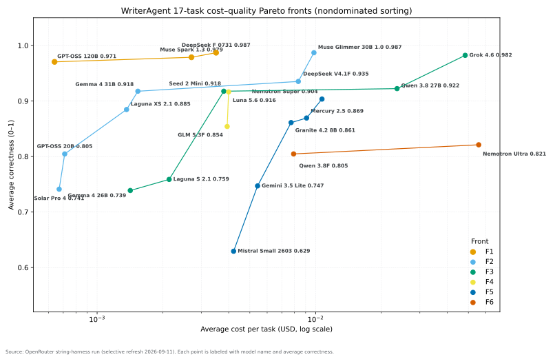

# PersianWriterAgent

> **Persian-first scholarly writing and research assistance for LibreOffice.**

PersianWriterAgent is a focused Persian-language layer built on [WriterAgent](https://github.com/KeithCu/writeragent). It is designed for serious Persian academic and professional writing: conservative normalization, reviewed spelling corrections, terminology support, and eventually context-aware scholarly assistance.

The project keeps the writer in control. Automatic corrections are deliberately conservative, explainable, reproducible, and reviewable through LibreOffice Track Changes.

**Current Persian milestone:** `v0.3.1` — mechanical normalization + reviewed spelling layer.

[](LICENSE)
[](https://github.com/mmyazdanpanah/persianwriteragent/tree/master/plugin/persian)

### Contribute

PersianWriterAgent is open to contributions from developers, Persian-language researchers, linguists, writers, LibreOffice users, and other interested contributors.

Useful contributions include Persian spelling and normalization improvements, conservative terminology rules, tests, reproducible bug reports, LibreOffice integration fixes, documentation, accessibility, and performance improvements.

Start here:

- **[Contributing guide](CONTRIBUTING.md)** — development setup, testing, language-layer rules, and pull requests
- **[Project idea and principles](IDEA.md)** — why the Persian layer is intentionally conservative
- **[Development invariants](AGENTS.md)** — repository-wide engineering rules
- **[Issues](https://github.com/mmyazdanpanah/persianwriteragent/issues)** — bugs and concrete feature requests
- **[Pull requests](https://github.com/mmyazdanpanah/persianwriteragent/pulls)** — proposed changes

Small, focused pull requests are especially welcome. For Persian language changes, please include before/after examples and the linguistic or technical rationale.

---

## About this fork

This repository is a maintained Persian-focused fork/layer of WriterAgent. It is **not a reimplementation** of WriterAgent.

The upstream project provides the LibreOffice extension architecture, AI tooling, MCP/ACP integration, Python execution, document tooling, and broader application infrastructure. PersianWriterAgent adds Persian-specific behavior while keeping that upstream foundation as intact as practical.

The Persian development path is intentionally layered:

```text
mechanical normalization
        ↓
reviewed spelling dictionary
        ↓
future terminology layer
        ↓
future contextual scholarly assistance
```

When a normalization is ambiguous or context-dependent, PersianWriterAgent prefers not to change it automatically.

### Next Phase: Persian LLM Integration

The next development phase is focused on integrating a Persian-tuned language model as an optional, configurable assistance layer.

This work will build on WriterAgent's existing functions and extension architecture rather than creating a separate writing-assistant system from scratch. The goal is to provide Persian-aware contextual assistance for tasks such as academic writing, editing, terminology, and style while keeping the underlying WriterAgent functionality intact.

The model layer will remain adjustable so different compatible models can be tested and used according to the user's hardware, task, and workflow.

This integration is currently under active development and is planned for the next release.

---


[](https://www.gnu.org/licenses/gpl-3.0.html)
[](https://www.python.org/downloads/)
[](https://www.libreoffice.org/)
[](https://github.com/KeithCu/writeragent/releases)


[CI status page](https://keithcu.github.io/writeragent/)

**Python, NumPy, and Agentic AI for LibreOffice (Writer, Calc, and Draw)**

Run Python and scientific compute directly in spreadsheet formulas, edit documents with private local-first AI, conduct autonomous web research, generate diagrams, and automate office workflows — without cloud lock-in.

The project is distributed as three standalone extension packages (*install only one at a time*):

| Package | What's Included | Best For |
| :--- | :--- | :--- |
| 🤖 **[WriterAgent](docs/features.md)** (`WriterAgent.oxt`) *(Full stack)* | Everything in LibrePy and LibreHarper + AI sidebar, `=PROMPT()`, web research, Calc → Python converter, MCP server | Users wanting the complete AI assistant, spreadsheet converter, and scientific compute suite |
| 🐍 **[LibrePy](docs/scripting/librepy-split.md)** (`LibrePy.oxt`) | Python runtime, `=PY()`, NumPy, pandas, SymPy, Monaco, Jupyter **File → Open** `.ipynb`, domain helpers, OCR | Users who want Python and Data Science in Calc/Writer without AI or API keys |
| ✍️ **LibreHarper** (`LibreHarper.oxt`) | Standalone offline [Harper](https://github.com/Automattic/harper) grammar engine for Writer | Users who only want fast, local grammar checking without AI or Python stacks |

**[Download .oxt Releases](https://github.com/KeithCu/writeragent/releases/latest)** · [Feature Index](docs/features.md) · [NumPy in LibreOffice Guide](docs/enabling_numpy_in_libreoffice.md) · [Discussions](https://github.com/KeithCu/writeragent/discussions)

---

## Key Capabilities

### 🤖 Local-First Agentic AI & Writing (Writer)

- **Sidebar Chat with Multi-turn Tool Calling** — Edit, restructure, or expand documents using natural language. 9 core tools plus dozens of [specialized sub-agents](docs/writer/specialized-toolsets.md) for page layout, footnotes, bookmarks, revisions, and forms.
- **Format-Preserving Edits** — Surgical redlines and section rewrites maintain your existing formatting (bold, italics, highlights, font sizes, tables, and nested lists) without clobbering styles.
- **Autonomous Web Research** — Integrated private [smolagents](https://github.com/huggingface/smolagents) loop with DuckDuckGo. Synthesizes multiple web sources and updates open documents with real-time facts and citations. [Agent Search](docs/chat/search.md)
- **Real-Time Grammar & Proofreading** — Local, privacy-preserving grammar checking via [Harper](https://github.com/Automattic/harper) (fast, auto-installing), [LanguageTool](https://languagetool.org), or LLM endpoints with mixed-language sentence detection. [Details](docs/writer/grammar-checker-plan.md)
- **Math & LaTeX Import** — Converts LaTeX and MathML into native, editable LibreOffice Math objects. [Math Guide](docs/writer/math-tex.md)

### 🐍 Python & Scientific Computing (Calc & Writer)

- **Native `=PY()` Spreadsheet Formulas** — Execute Python, NumPy, and pandas expressions directly inside Calc cells with automatic array spill, shared workbook kernels, and persistent scripts.
  - `=PY("np.mean(data)"; A1:A10)` — Calculate array statistics directly on Calc ranges.
  - `=PY("data.to_pandas(date_cols=True)"; A1:C10)` — Load sheet data into pandas with automatic type and date parsing.
  - [NumPy in LibreOffice Guide](docs/enabling_numpy_in_libreoffice.md) · [Data Shapes & Type Mapping](docs/calc/py-data-shapes.md)
- **Embedded Monaco Code Editor** — Write, test, and debug multi-line Python scripts directly inside cells or through the **Tools → Run Python Script** environment with syntax highlighting, autocomplete, and diagnostics.
- **Built-in Scientific & Analytics Domains** — Ready-to-use helpers for EDA, outlier detection, OLS regression, KMeans clustering, Monte Carlo simulations, symbolic algebra (SymPy), plotting, and physical unit conversions (`convert_quantity(60, "mph", "m/s")` → `26.8224 m/s`). [Domain Reference](docs/scripting/numpy-domains.md) · [Analysis Helpers](docs/calc/analysis-tools.md)
- **Spreadsheet → Python Converter *(WriterAgent)*** — Translate 235+ classic Calc/Excel formulas into clean Python expressions using the built-in `calc.*` parity library while preserving constants, dates, and cell formats. [Details](docs/calc/spreadsheet-to-python-import.md)
- **Local Vision & OCR** — Extract text from embedded images or scanned documents directly into Writer and Calc via offline Docling OCR. [Vision Guide](docs/images/recognition.md)
-  **Jupyter Notebook Support** — **File → Open…** a `.ipynb` (or double-click / `soffice notebook.ipynb`) creates a Writer document with markdown, editable code fields, and ▶ run buttons against a shared Python kernel. [Jupyter in Writer](docs/writer/jupyter-notebook-import.md)

### 📊 Diagrams, Slides & Multi-Modal (Draw & Impress)

- **Diagram & Presentation Generation** — Generate, adjust, and style flowcharts, shapes, connectors, speaker notes, and slide transitions through chat commands or Python scripts. [Details](docs/draw/impress-specialized-toolsets.md)
- **LO-DOM Semantic Tree** — Structural understanding of headings, sections, tables, and relationships across entire documents. [Semantic Tree](docs/writer/lo-dom-semantic-tree.md)
- **Cross-Document Search & Memory** — Query other documents in the same folder via local embeddings / hybrid search, with persistent cross-session agent memory. [Embeddings](docs/embeddings.md) · [Memory](docs/hermes-agent-patterns.md)

### 🔌 Integrations & Extensibility

- **Model Context Protocol (MCP) Server** — Connect external IDEs and agents (Cursor, Claude Desktop, LM Studio) to read and edit open LibreOffice documents over `http://localhost:18765/mcp`. [MCP Protocol](docs/mcp-protocol.md)
- **Pluggable Agent Backends** — Switch the chat engine to external agents such as [Hermes](https://github.com/NousResearch/hermes-agent), [Claude Code](https://docs.anthropic.com/en/docs/claude-code), [Mistral Vibe](https://github.com/mistralai/mistral-vibe), [Grok Build](https://zed.dev/acp/agent/grok-build), or [OpenCode](https://opencode.ai/docs/acp/) via ACP. [Cursor Plugin](https://github.com/KeithCu/cursor-libreoffice) · [LO Skill](https://github.com/KeithCu/libreoffice-skill)

Full catalog of capabilities: **[docs/features.md](docs/features.md)**.

---

## Installation & Setup

1. **Download** your chosen `.oxt` package from **[Latest Releases](https://github.com/KeithCu/writeragent/releases/latest)** and double-click to install (or open LibreOffice and go to **Tools → Extension Manager → Add**). *Remember to install only one extension package.*
2. **Restart** LibreOffice.
3. **Quick Configuration:**
   - **Python / LibrePy users:** Open Calc, check **Tools → LibrePy (or WriterAgent) → Settings → Python**, and click **Test** to verify your environment and NumPy/pandas availability.
   - **AI / WriterAgent users:** Open **WriterAgent → Settings** and enter your endpoint (e.g. `http://localhost:11434` for local [Ollama](https://ollama.com/), or an [OpenRouter](https://openrouter.ai/) / [Together.AI](https://www.together.ai/) API key). Open the sidebar via **View → Sidebar → WriterAgent** or press **Ctrl+Q** / **Ctrl+E**.

> **UI Modes:** In classic toolbar mode, access tools through the top menubar. In tabbed/ribbon interfaces, use the **WriterAgent** chat sidebar and/or the **Python** sidebar (Writer + Calc): Settings `⚙`, Python `🐍`, LaTeX math or Edit cell, search `🔍` (WriterAgent chat only), and full menus via `☰`.

For detailed setup instructions, see the **[Install and Troubleshooting Guide](docs/install-troubleshooting.md)**.

---

## Showcase

**Python in LibreOffice Writer**


**Spreadsheet Analytics & Dashboard**


**Hermes + Opus 4.6 (Autonomous Web Research)**


**Math Expressions & LaTeX**


**Arch Linux Resume**


**Diagrams in Draw**


---

## Benchmarks & Evaluation

WriterAgent's **LLM Evaluation Suite** benchmarks models on Writer, Calc, and Draw tasks. The **2026-09-01 snapshot** uses the **17-task string harness** — it emulates document and tool behavior without running LibreOffice (OpenRouter, live token pricing). Full methodology: [docs/eval/benchmarks.md](docs/eval/benchmarks.md).



Distance-to-frontier view: [docs/eval/pareto-distance.svg](docs/eval/pareto-distance.svg).

| Model | Correctness<br>avg task score (0–1) | Value<br>Correctness² ÷ $/task |
| ----- | ----- | ----- |
| openai/gpt-oss-120b | 0.971 | 1290 |
| upstage/solar-pro4 | 0.741 | 800 |
| openai/gpt-oss-20b | 0.687 | 606 |
| poolside/laguna-xs-2.1 | 0.826 | 571 |
| google/gemma-4-31b-it | 0.918 | 559 |
| meta/muse-spark-1.3-contributor | 0.979 | 350 |
| google/gemma-4-26b-a4b-it | 0.680 | 329 |
| deepseek/deepseek-v4-flash-0731 | 0.987 | 274 |
| poolside/laguna-s-2.1 | 0.759 | 262 |
| openai/gpt-5.6-luna | 0.981 | 219 |
| bytedance-seed/seed-2.0-mini | 0.918 | 200 |
| z-ai/glm-5.3-flash | 0.913 | 193 |
| mistralai/mistral-small-2603 | 0.629 | 188 |
| google/gemini-3.5-flash-lite | 0.806 | 116 |
| meta/muse-glimmer-30b | 0.987 | 85 |
| ibm-granite/granite-4.2-8b | 0.802 | 83 |
| inception/mercury-2.5-preview | 0.811 | 74 |
| nvidia/nemotron-3.5-lightning | 0.315 | 37 |
| qwen/qwen3.8-27b | 0.922 | 33 |
| minimax/minimax-m3 | 0.820 | 32 |
| x-ai/grok-4.6 | 0.982 | 20 |
| qwen/qwen3.8-flash | 0.118 | 12 |

---

## Documentation & Architecture

| Topic | Documentation Link |
| :--- | :--- |
| **Feature Index** | [docs/features.md](docs/features.md) |
| **NumPy & Python in Calc** | [docs/enabling_numpy_in_libreoffice.md](docs/enabling_numpy_in_libreoffice.md) · [docs/calc/py-data-shapes.md](docs/calc/py-data-shapes.md) |
| **LibrePy Core Architecture** | [docs/scripting/librepy-split.md](docs/scripting/librepy-split.md) |
| **Domain Helper Functions** | [docs/scripting/numpy-domains.md](docs/scripting/numpy-domains.md) · [docs/calc/analysis-tools.md](docs/calc/analysis-tools.md) |
| **Full Architecture** | [docs/writeragent-architecture.md](docs/writeragent-architecture.md) · [docs/framework/formal-verification.md](docs/framework/formal-verification.md) |
| **Model Context Protocol (MCP)** | [docs/mcp-protocol.md](docs/mcp-protocol.md) |
| **Embeddings & Search** | [docs/embeddings.md](docs/embeddings.md) |
| **Benchmarks** | [docs/eval/benchmarks.md](docs/eval/benchmarks.md) |
| **Localization (34 Locales)** | [docs/localization.md](docs/localization.md) |
| **Code Explorer** | [DeepWiki](https://deepwiki.com/KeithCu/writeragent) |
| **Cursor / Agent Skills** | [cursor-libreoffice](https://github.com/KeithCu/cursor-libreoffice) · [libreoffice-skill](https://github.com/KeithCu/libreoffice-skill) |

Under the hood, all agentic interactions are governed by a formally verified finite state machine with strict type checking and static analysis.


---

## Project Evolution

A chronicle of building a Python runtime and AI suite inside LibreOffice:

- **Week 1**: [Initial fork, sidebar chat, multi-turn tools, and async streaming](https://keithcu.com/wordpress/?p=5060)
- **Week 2 & 3**: [MCP, research sub-agent, voice support, and evaluation dashboard](https://keithcu.com/wordpress/?p=5112)
- **Week 4–6**: [State machines, formal verification, and specialized toolsets](https://keithcu.com/wordpress/?p=5245)
- **Week 6 & 7**: [Async grammar checking and TeX import support](https://keithcu.com/wordpress/?p=5276)
- **Week 8+**: [NumPy compute bridge, `=PY()` Calc add-in, Monaco editor, and LibrePy core split](docs/scripting/librepy-split.md)

---

## Contributing & Development

[](https://deepwiki.com/KeithCu/writeragent)
[Discussions](https://github.com/KeithCu/writeragent/discussions)

**Prerequisites:** Python 3.11–3.13 for development (pinned to **3.13** via [`.python-version`](.python-version)), [uv](https://docs.astral.sh/uv/). Run `make check-setup` to verify. On macOS: install `make`, `gettext`.

```bash
git clone https://github.com/mmyazdanpanah/persianwriteragent.git
cd persianwriteragent
uv python install 3.13
uv sync
make deploy          # Builds & installs WriterAgent.oxt (or: make deploy writer)
make test
make help
```

To build and test the standalone extension variants:
```bash
# Standalone Python / NumPy compute suite (LibrePy)
make build-core      # Produces build/LibrePy.oxt
make deploy-core     # Installs LibrePy.oxt (removes WriterAgent)

# Standalone Harper grammar checker (LibreHarper)
make build-harper    # Produces build/LibreHarper.oxt
make deploy-harper   # Installs LibreHarper.oxt
```

See [AGENTS.md](AGENTS.md) (invariants), [docs/repo-map.md](docs/repo-map.md) (entry points), and [docs/scripting/librepy-split.md](docs/scripting/librepy-split.md) for architecture details.

---

## Credits

| Project | Contribution |
| :--- | :--- |
| [localwriter](https://github.com/balisujohn/localwriter) | Original Writer LLM extension (John Balis) |
| [LibreCalc AI Assistant](https://extensions.libreoffice.org/en/extensions/show/99509) | Calc AI foundation and inspiration |
| [LibreOffice MCP Extension](https://github.com/quazardous/mcp-libre) | MCP server patterns, Makefile, tool registry |
| [Hermes Agent](https://github.com/NousResearch/hermes-agent) | Tool-call parsers, JSON repair, memory patterns |
| [latex2mathml](https://github.com/roniemartinez/latex2mathml) | LaTeX → MathML |
| [mathml-to-latex](https://github.com/asnunes/py-mathml-to-latex) | MathML → LaTeX (Writer formula export) |
| [isodate](https://github.com/gweis/isodate) | ISO 8601 duration parse/format (Calc wire) |

---

## License

**GNU GPL v3 (or later)** — see [`LICENSE`](LICENSE). Originally MPL 2.0; relicensed in 2026 for stronger reciprocity and library compatibility.

| Year | Contribution | Contributor |
| :--- | :--- | :--- |
| 2024 | Original release | John Balis |
| 2025–2026 | Config, registries, build system | quazardous |
| 2026 | Calc integration (originally MIT) | LibreCalc AI Assistant |
| 2026 | Modifications and relicensing | KeithCu |
