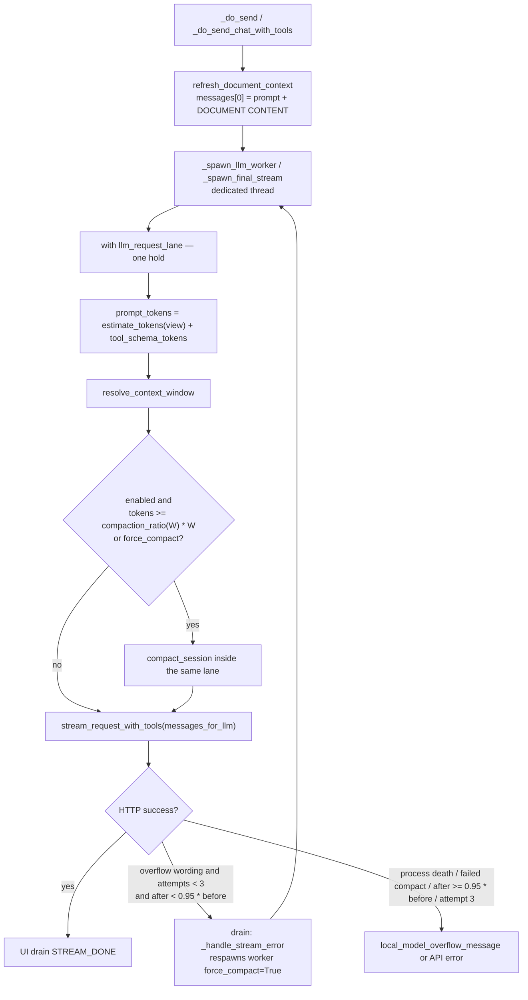
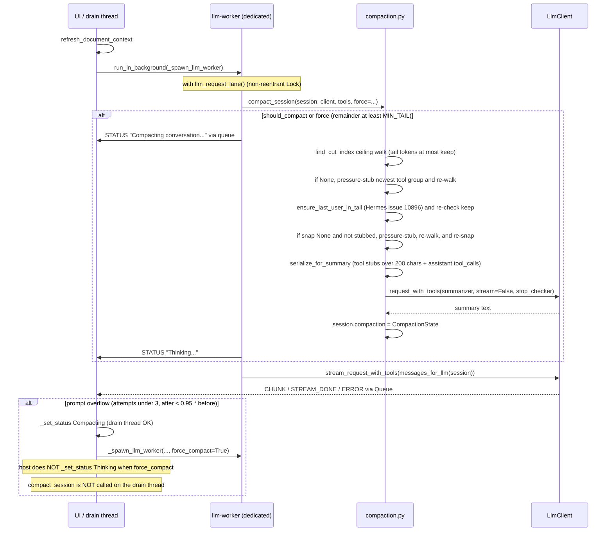

# Auto-compact conversation history (WriterAgent Compaction v1)

| Field | Value |
| --- | --- |
| **Author** | KeithCu / Assistant |
| **Date** | 2026-09-10 |
| **Status** | Implemented (v1) |
| **Location** | `docs/chat/compaction-dev-plan.md` |
| **Scope** | WriterAgent sidebar `ChatSession` (Chat, Web Research, Librarian) in Writer / Calc / Draw. Not LibrePy, not `=PROMPT()`, not smol ReAct (`smol_agent.py`). |
| **Reference designs** | **OpenClaw** client-side compaction essence and **Hermes Agent** policy knobs. (Full research in Appendix). |

---

## Overview

WriterAgent sidebar chat sends conversational history along with a freshly rebuilt `[DOCUMENT CONTENT]` system message on each turn. In long editing sessions—especially against local Ollama or `llama.cpp` instances running with small or VRAM-constrained context windows (4k–8k `num_ctx`)—prompt history quickly fills the context window and triggers errors. On `llama.cpp`, this frequently manifests as an HTTP 500 (`llama-server process has terminated` or `truncating input prompt`) rather than a clean 400 error.

**Compaction v1** solves this problem by automatically summarizing older conversation turns into a structured summary when prompt tokens cross a tiered threshold, while preserving a recent tail verbatim.

### Key Highlights of the Implementation

- **Pure, UNO-free module:** All compaction logic lives in `plugin/chatbot/compaction.py`, fully decoupled from LibreOffice/UNO and easily unit-tested with standard pytest.
- **Cached model-facing view (`messages_for_llm`):** Original turns remain untouched in `session.messages` and the SQLite history database. The UI continues to show full message history; only the payload dispatched to the LLM worker is compacted.
- **Tiered compaction threshold:** 70% of window for small contexts (<= 8k), 75% for mid-size contexts (< 512k), and 50% for large contexts (>= 512k).
- **Remaining-budget ceiling & `GEN_RESERVE`:** Tail length is clamped to available headroom after accounting for document snapshot, summarizer budget, tools, and generation reserve. Exact fill of `n_ctx` is rejected.
- **Tool-pair integrity & last-user preservation:** Assistant `tool_calls` are never separated from their corresponding `role=tool` responses, and the last real user prompt is snapped into the verbatim tail (Hermes `#10896`).
- **Tail-pressure stubbing:** If oversized tool results in the newest turn group threaten context limits on 4k windows, tool result bodies are stubbed in the view (`[name] (N chars)`), leaving the underlying session messages intact.
- **Overflow retry loop:** On prompt-too-large HTTP errors (distinguished from server process crashes), the turn is automatically retried with `force_compact=True` up to 3 times, gated by a more-than-5% shrink (`after < before * 0.95`; exact 5% is not a shrink).
- **Dedicated worker execution:** Compaction runs inside the existing `llm_request_lane` lock on background worker threads, never stalling the UI thread.
- **Single kill switch:** `chat_compaction_enabled` in `writeragent.json` disables both proactive compaction and overflow retries.
- **Mock-sidebar inflate** (Packet K) must pad the URP client's document `ChatSession` (`INFLATE_HISTORY&uid=` → live-panel map), not WeakSet[0] and not soffice `getCurrentComponent()`. Leftover Calc after Packet P / E12 made K1/K2 look like a compact-wire break (`n_messages=2`, no summarizer, no respawn).

### Invariants

Do not break these:

- Never compact `messages[0]`. `[DOCUMENT CONTENT]` is rebuilt every send; the summarizer sees `messages[prev_kept:new_cut]`, never index 0.
- Never mutate `session.messages` or rewrite `history_db`. Compaction is a cached view (`session.compaction` + `messages_for_llm`).
- `chat_compaction_enabled: false` disables overflow retry as well as proactive compact. One kill switch.
- No 256k unknown-window fallback. Unresolved window → `no_window` and skip.
- Do not subtract `chat_max_tokens` from the trigger window. llama.cpp shares `n_ctx` with output (issue #570); `GEN_RESERVE` is the headroom.

---

## Architecture

### Flowchart



### Sequence Diagram



---

## Implemented Mechanics & Components

### 1. The 8-Step Compaction Algorithm

1. **Estimate prompt tokens:** Calculate total tokens for `messages_for_llm(session)` plus active tool schemas using `estimate_tokens_rough`.
2. **Evaluate trigger threshold:** Compare prompt tokens against `int(window * compaction_ratio(window))` (or `force=True` on overflow recovery).
3. **Calculate ceiling tail budget:** Determine maximum allowable tail tokens (`keep_recent_tokens`) by subtracting system/document tokens, tool tokens, summarizer budget, and `GEN_RESERVE` from `window`.
4. **Locate boundary cut:** Perform a reverse ceiling walk to find `cut_index` where `tail_sum <= keep_tokens`. Snap forward to preserve tool-call/result integrity. Snap backward if necessary to guarantee the last real user turn is in the tail (`ensure_last_user_in_tail`).
5. **Apply tail pressure if needed:** If the newest assistant+tools group exceeds budget on tight windows, stub those tool bodies in the view (`pressure_stub_newest_tool_group`) and re-walk.
6. **Generate summary:** Serialize the uncompacted slice (`messages[prev_kept:new_cut]`), stubbing tool result bodies > 200 chars, and issue a single non-streaming LLM request with temporal anchoring.
7. **Construct and verify model view:** Build the view with live system message, summary user/assistant pair, and verbatim tail. If `after > window - GEN_RESERVE`, revert and fail safely.
8. **Cache state:** Store `CompactionState` on `session.compaction` so subsequent rounds and turns reuse the summary.

### 2. Module Placement & Public API

Implemented in [`plugin/chatbot/compaction.py`](../../plugin/chatbot/compaction.py). It does not import `panel`, `tool_loop`, or UNO.

```python
# Key Constants
CHARS_PER_TOKEN = 4
COMPACTION_RATIO_SMALL = 0.70    # W <= 8192
COMPACTION_RATIO_DEFAULT = 0.75  # 8192 < W < 512_000
COMPACTION_RATIO_LARGE = 0.50    # W >= 512_000
SMALL_CTX_WINDOW_LIMIT = 512_000
MAX_OVERFLOW_COMPACTION_ATTEMPTS = 3
MIN_SHRINK_RATIO = 0.95          # Retry only if after < before * 0.95 (exact 5% is not a shrink)
KEEP_RECENT_FRACTION = 0.30
KEEP_RECENT_FLOOR = 2048
KEEP_RECENT_CAP = 20_000
MIN_TAIL_TOKENS = 256
MAX_SUMMARY_CHARS = 16_000
IMAGE_BLOCK_TOKENS = 2000
AUDIO_BLOCK_TOKENS = 2000
PRUNE_MIN_CHARS = 200
MAX_TOOL_CALL_ARGS_CHARS = 4000
```

#### Core Data Structures

```python
@dataclass(frozen=True)
class CompactionState:
    summary: str
    first_kept_index: int              # index into session.messages (>= 1)
    tokens_before: int
    window: int
    stubbed_tool_call_ids: tuple = ()  # view-only tail-pressure stubs

@dataclass(frozen=True)
class CompactResult:
    compacted: bool
    reason: str  # "below_threshold" | "nothing_to_compact" | "no_window" | "ok" | "failed" | "aborted" | "disabled"
    tokens_before: int | None = None
    tokens_after: int | None = None
```

### 3. Cached View Model (`messages_for_llm`)

WriterAgent does not mutate `session.messages` in-place and does not rewrite SQLite history. Instead, `messages_for_llm(session, tools)` constructs the exact model-facing payload on the fly:

```
[session.messages[0]]                       # Always live system + DOCUMENT CONTENT
+ summary_pair(state.summary)               # User summary + dummy Assistant ack
+ tail from session.messages[state.first_kept_index:]
    # role=tool matching stubbed_tool_call_ids replaced by [name] (N chars)
```

Then `sanitize_tool_pairs` runs to prune orphaned tool calls or results. If `session.compaction is None`, it returns a sanitized copy of `session.messages`.

### 4. Token Estimator (`estimate_tokens_rough`)

Uses Hermes Agent's rough token estimator adapted with standard library `re` and UTF-8 byte counting:
- ASCII text: `(len(text) + 3) // 4`
- CJK / Hangul / Kana: 1 token per codepoint
- Other non-ASCII (Cyrillic, Arabic, Greek): `(len(utf8_bytes) + 3) // 4`
- Images & Audio: Fixed 2000 tokens per block.
- Tool schemas: Dumped to compact JSON and token-estimated.

### 5. Context Window Resolution (`resolve_context_window`)

1. **Ollama live `num_ctx`:** When provider is `"ollama"`, queries `/api/show` for runtime `num_ctx` via `query_ollama_runtime_num_ctx`. Missing `num_ctx` returns `None` immediately — no `/v1/models` cache and no catalog (issue #570).
2. **Cached `/v1/models` length:** For every other provider, `cached_v1_context_tokens` reads the process memo filled when Settings/sidebar already fetched the list (`context_length` or Groq `context_window`). Harvest only — compact does **not** GET `/v1/models`. OpenRouter uses `:nitro` / dynamic-suffix equivalence. Sidebar skips OpenRouter/Together fetches (`massive_providers`); those live lengths appear only after Settings has fetched.
3. **Catalog lookup:** `DEFAULT_MODELS` as before, including the custom any-id pass (`writeragent-mock` → 32768).
4. **Unknown (`None`):** If the window cannot be resolved, returns `None`. Compaction safely skips execution (`reason="no_window"`), preventing erroneous truncation.

See [`context-window-fidelity-brief.md`](context-window-fidelity-brief.md).

### 6. Trigger Policy & Headroom

```python
def compaction_ratio(window: int) -> float:
    if window >= SMALL_CTX_WINDOW_LIMIT:
        return COMPACTION_RATIO_LARGE     # 0.50
    if window <= 8192:
        return COMPACTION_RATIO_SMALL     # 0.70
    return COMPACTION_RATIO_DEFAULT       # 0.75

def should_compact(tokens: int, window: int | None, enabled: bool = True) -> bool:
    if not enabled or window is None or window <= 0:
        return False
    return tokens >= int(window * compaction_ratio(window))
```

### 7. Remaining-Budget Ceiling Walk & `GEN_RESERVE`

On small contexts (4k), exact fill of `n_ctx` causes generation overflow or Ollama silent prompt-clipping. `gen_reserve(window)` reserves generation room:
- `gen_reserve(window) = min(512, max(256, window // 16))` (256 tokens for 4k, 512 tokens for 8k+).
- `_summary_budget(window) = min(1024, max(256, window // 8))`
- `keep_recent_tokens`: Calculates `remainder = window - system_tokens - tool_tokens - summary_budget - reserve`.
- On overflow retry (`force=True`), the clamped tail budget is halved to guarantee token shrinkage.
- Post-apply check: If `tokens_after > window - GEN_RESERVE`, the state is reverted and compaction reports `failed`.

### 8. Split Point & Last-User Preservation (`#10896`)

- `find_cut_index`: Walks backwards from newest messages until accumulated tokens exceed `keep_tokens`. Snaps forward to a legal boundary (`user` or `assistant`), ensuring tool results are not separated from their tool calls.
- `ensure_last_user_in_tail`: Pulls the cut point back so the last real user prompt remains in the verbatim tail. If doing so exceeds `keep_tokens`, tail pressure stubbing is invoked.

### 9. Tail-Pressure Stubs & Summarizer Serialization

- **Summarizer Input:** `serialize_for_summary(messages)` stubs older `role=tool` responses > 200 chars into `[tool_name] (N chars)` and formats assistant tool calls as `name(args)` capped at 4000 characters.
- **View-Only Tail Pressure:** `pressure_stub_newest_tool_group` stubs oversized tool responses in the newest assistant+tools group *only in the model view*. `session.messages` retains full output.

### 10. Overflow Retry Loop vs. Process Death

In `_handle_stream_error` (`plugin/chatbot/tool_loop.py`):
1. Distinguishes true prompt overflows from dead processes:
   - Process death markers (`llama-server process has terminated`, `0xc0000005`) do **not** retry.
   - Rate limits / 429 TPM errors do **not** retry.
   - Known overflow strings (`context length exceeded`, `prompt too long`, `truncating input prompt`, etc.) trigger retry.
2. Max 3 retry attempts.
3. Requires more than 5% shrink (`tokens_after < tokens_before * 0.95`). Exact 5% is not a shrink.
4. Respawns worker thread with `force_compact=True`. Never executes compaction on the UI drain thread.

---

## Configuration & Observability

### Configuration

Stored in `writeragent.json` under the user's LibreOffice profile (defined in `plugin/framework/config_schema.py`):

```json
{
  "chat_compaction_enabled": true
}
```

- When set to `false`, both proactive compaction and overflow-recovery retries are completely disabled.
- No UI settings dialog page in v1.

### Observability

- Logged at `INFO` level: window size, token counts before/after, cut indices, tail-pressure actions, and overflow retry attempts.
- Logged at `EXCEPTION` level: Any unexpected failure during summarization, safely preserving history uncompacted.
- Sidebar status: Updates to `"Compacting conversation..."` via `StreamQueueKind.STATUS` only when an actual summarizer call is underway, returning to `"Thinking..."` when streaming begins.

---

## Future Features & Enhancements to Consider

The current implementation represents **Version 1**. The following features and enhancements are planned or under consideration for future iterations:

### 1. Manual `/compact` and `/tokens` Slash Commands
- Expose `/compact` in chat to allow users to trigger compaction on demand.
- Add `/tokens` to show current estimated prompt tokens, context window limit, and usage ratio.
- Depends on completing general slash-command dispatch (`plugin/chatbot/slash_commands.py`).

### 2. Sidebar UI Notification / Toast
- Provide a subtle visual indicator (e.g., small badge, toast, or system message in chat) when auto-compaction occurs.
- OpenClaw is silent by default; v1 is silent except for the drain status text. A subtle collapsible notice (e.g. *"Compacted 8 older turns into summary"*) would improve transparency.

### 3. Dedicated Compaction Model Override (`chat_compaction_model`)
- Allow configuring a faster, cheaper model (e.g. `ministral-8b`, `haiku`, or local quantized helper) to generate compaction summaries instead of using the primary chat model.
- Requires secondary client routing or lightweight auxiliary completion calls.

### 4. User-Configurable Compaction Ratio (`chat_compaction_ratio`)
- Add an optional config key to allow power users to override the trigger ratio (e.g. raise to 85% or lower to 60%).
- Could follow Hermes's raise-only semantics (`max(configured, tier_floor)`) to avoid premature compaction on large models.

### 5. HTTP 413 Byte-Based Scoring (Calc & Vision Workflows)
- In screenshot-heavy Calc sessions, prompts can trigger HTTP 413 (Payload Too Large) due to serialized base64 image bytes even when token counts appear within limits.
- Future work can incorporate Hermes's byte-based scoring (`_recover_payload_too_large`) to downscale images or prune older screenshots on 413 errors.

### 6. Context-window resolution fidelity

- **Shipped.** Resolver order is Ollama `num_ctx` → cached `/v1/models` length → `DEFAULT_MODELS` → `None`. Details: [`context-window-fidelity-brief.md`](context-window-fidelity-brief.md).
- Still inert when the window is unknown (unlisted id, LM Studio OpenAI row with no length field, llama.cpp without a published window).
- Do **not** invent Hermes-sized fallbacks, harvest `max_context_length`, or subtract `chat_max_tokens` on llama.cpp (#570).

### 7. Dynamic Provider-Aware `max_tokens` Reservation
- Some cloud providers decouple output generation limits from context windows, while local `llama.cpp` shares `n_ctx` between prompt and completion.
- Inspect provider capabilities to dynamically subtract `chat_max_tokens` when supported, or rely on `GEN_RESERVE` for shared-context engines.

### 8. Native Server-Side Compaction Integration
- Leverage vendor-native context management (such as OpenAI Responses API `/responses/compact` or Anthropic server compaction) when connecting to compatible endpoints.
- See [`docs/chat/responses-api-plan.md`](responses-api-plan.md) for details.

### 9. Long-Term Memory Flush Integration
- Trigger a memory extraction / flush turn (similar to OpenClaw's pre-compaction memory flush) before summarizing, saving durable facts into `MEMORY.md` before turns leave the active context.

### 10. Session Persistence of Compaction State Across Restarts
- In v1, restarting LibreOffice reloads raw message turns from SQLite, re-summarizing only when the threshold is crossed again.
- Persisting `CompactionState` directly in `history_db` would avoid re-summarizing upon opening an existing long session.

---

## Test Coverage

Compaction v1 is covered by comprehensive unit, error, and integration tests:

### Unit Tests ([`tests/chatbot/test_compaction.py`](../../tests/chatbot/test_compaction.py))
- **Threshold Tiers:** Tests 70%, 75%, and 50% ratios across 4k, 8k, 128k, and 512k+ windows.
- **Fit Guarantee:** Pinned 4k window tests with 2000-token system context proving post-compaction view <= 4096 - 256 tokens.
- **Estimator Verification:** Verifies ASCII, CJK codepoints, Cyrillic UTF-8 byte weighting, and image/audio token constants.
- **Document Snapshot Exclusion:** Proves `messages[0]` is never passed to summarizer and live document context is always prefixed dynamically.
- **Tool-Pair Integrity:** Asserts `tool_calls` and `role=tool` messages are never separated across summary boundaries.
- **Failure Safety:** Validates that LLM summarizer exceptions leave `session.messages` and `session.compaction` completely intact.
- **Window resolver:** Cached `/v1/models` length beats catalog; Ollama ignores the v1 cache; compact does not GET `/v1/models`.
- **Overflow Classification:** Tests distinction between retryable overflow phrases and non-retryable server process death or rate limits.
- **Tail Pressure & `#10896` Snap:** Verifies behavior when large tool results or user turns push the tail over budget.
- **Shrink Gate:** Enforces more than 5% token reduction on overflow retry (`after < before * 0.95`).

### Tool Loop Error & Retry Tests ([`tests/chatbot/test_tool_loop_errors.py`](../../tests/chatbot/test_tool_loop_errors.py))
- Verifies worker respawn with `force_compact=True` on prompt overflow.
- Verifies maximum 3 attempts before falling back to standard error display.
- Verifies process death (`llama-server process has terminated`) does not retry.
- Verifies `chat_compaction_enabled=False` aborts retries immediately.

### Mock Integration Tests
- Packet K test suite (`make test-mock-sidebar FILTER=K`) tests compaction against `writeragent-mock`.

---

## Appendix: Research & Prior Art (OpenClaw, Hermes, Odysseus)

This section archives the research, external codebase analyses, and design comparisons that informed WriterAgent Compaction v1.

### 1. Dual Reference: OpenClaw Design

Sources: `openclaw/docs/concepts/compaction.md`, `openclaw/docs/reference/session-management-compaction.md`, `packages/agent-core/src/harness/compaction/compaction.ts`.

#### Scheduling Paths
1. **Overflow recovery:** Triggered when the provider returns a context overflow error; compacts and retries up to `MAX_OVERFLOW_COMPACTION_ATTEMPTS = 3`.
2. **Usage-based preflight:** Evaluates `projected usage >= contextWindow - reserveTokens`.
3. **Client-side trigger:** `shouldCompact(tokens, window, settings)` triggers when `tokens > window - reserveTokens`. Defaults: `reserveTokens = 16384`, `keepRecentTokens = 20000`.

#### Small Window Reserve Clamping
OpenClaw prevents small-context models from triggering on token 1 by clamping reserves:
`min(8000, floor(window * 0.5))`. An 8k model triggers at 50%, not token 1.

#### Invariants & Key Concepts
- Server-side 70% threshold in OpenClaw applies **only** to Anthropic/OpenAI server-side compact endpoints (`resolveAnthropicCompactThreshold`), not client-side compaction.
- Preserves full transcript on disk; compaction only alters what the model sees.
- Tool-call / result pairs kept together via `findCutPoint` and `isCutPointMessage`.
- `IMAGE_BLOCK_TOKENS = 2000`.
- Ceiling vs. Floor: OpenClaw's `findCutPoint` walks until `accumulated >= keepRecentTokens` (a floor). WriterAgent inverted this into a ceiling (`tail_sum <= keep`) so small 4k windows are guaranteed to fit.

### 2. Dual Reference: Hermes Agent Design

Sources: `hermes-agent` 0.21.1 (Nous Research, MIT), `agent/context_compressor.py`, `agent/model_metadata.py`.

#### Trigger Math & Folklore
Hermes uses a multi-layered trigger system:
1. Config default starts at `0.50` (`50%`).
2. **Small-context raise-only floor (75%):** For all models with window < 512,000, `_effective_threshold_percent` overrides the ratio to `max(threshold, 0.75)`. Thus, **75% is Hermes's true measured default for all common context sizes** (128k, 200k, 256k).
3. **Absolute 64k token floor & 85% cap:** Hermes enforces `MINIMUM_CONTEXT_LENGTH = 64_000` (rejecting models below 64k). When the 64k floor exceeds 85% of effective window, it caps at 85%.
4. **Gateway Hygiene:** An independent pre-agent safety net triggers at 85% (`gateway/run_turn.py`).

#### Tail Modes & Last-User Preservation
- Lean tail mode uses `clamp(W * 0.025, 10000, 25000)` tokens. On a 4k window, a 10k token floor is unusable (2.4x the entire window).
- `_ensure_last_user_message_in_tail` (`#10896`): Guarantees the last real user prompt is preserved in the tail, winning over token budget in Hermes. WriterAgent adapted this snap but enforces the ceiling to prevent 4k overflows.

#### Pruning & Stubs
- Phase 1 tool pruning (`_prune_old_tool_results`): Stubs tool results > 200 chars outside the protected tail to `[tool_name] (N chars)`.
- `_pressure_demote_tail`: When the tail exceeds budget under pressure, stubs tool bodies in the tail starting with the largest results.

#### Rough Token Estimator
Hermes avoided `tiktoken` in favor of `estimate_tokens_rough`: ASCII at 4 chars/token, CJK codepoints at 1 token each, and non-ASCII at UTF-8 bytes / 4. WriterAgent adopted this algorithm under MIT license compliance.

### 3. Three-Way Comparison & Folklore Analysis

| Topic / Knob | OpenClaw | Hermes Agent | WriterAgent v1 |
| --- | --- | --- | --- |
| **Client trigger** | `tokens > window - reserve` (reserve 16k–20k; small window cap) | Config 50%, raised to 75% for W < 512k, capped at 85% for small models | **Tiered ratio:** 70% (W <= 8k), 75% (8k < W < 512k), 50% (W >= 512k) |
| **Small contexts (4k/8k)** | Reserve capped at 50% | Rejects models < 64k; 10k tail blows 4k | Tail clamped to remainder after `GEN_RESERVE`; 70% trigger; tail-pressure stubs |
| **Tail selection** | Floor: walk until >= keepRecent | Lean: clamp 10k–25k; last user wins over budget | Ceiling: walk until <= keep; last user snapped with ceiling re-check |
| **Tool result handling** | Keeps tool-call/result pairs intact | Phase 1 prune >200 chars + tail pressure demotion | Summarizer input stub >200 chars + view-only tail pressure stub for newest group |
| **Transcript mutation** | Compacted view; full transcript on disk | In-place SQLite rewrite + soft archive (`active=0`) | In-memory cached view; `session.messages` and DB untouched |
| **Estimator** | CJK chars/4 + last assistant usage delta | CJK=1 + UTF-8 bytes/4 (`estimate_tokens_rough`) | Hermes `estimate_tokens_rough` extract; images=2000 |
| **Overflow retry** | 3 attempts; active even if compaction disabled | 3 attempts; requires more than 5% token shrink | 3 attempts; requires more than 5% token shrink (`after < before * 0.95`); disabled if kill switch off |
| **Failure behavior** | Leave history intact | Drop middle with fallback summary by default | Leave history intact (revert to uncompacted state) |

#### Common Folklore Debunked
- **"Hermes is 85%":** Only true for gateway hygiene, the 64k floor cap, and specific Codex auto-raise rules. The actual tested default for 128k–512k models is 75%.
- **"Hermes is 50%":** Merely the config key value before the mandatory small-context floor overrides it to 75%.
- **"OpenClaw is 70%":** 70% only exists in OpenClaw's server-side Anthropic/OpenAI payload policy, not its client-side engine (`window - reserve`).

### 4. Hermes Steal vs. Omit Matrix

| Candidate | LOC in Hermes | Verdict | Reason / Adaptation |
| --- | ---: | --- | --- |
| `estimate_tokens_rough` + `_CJK_DENSE_RE` | ~25 | **Steal Function** | Superior to chars/4 for Cyrillic/Arabic. MIT copyright retained. |
| `_effective_threshold_percent` | ~5 | **Steal Algorithm** | Window-tiered ratio concept adapted; dropped 64k model rejection. |
| `_ensure_last_user_message_in_tail` (`#10896`) | ~15 | **Steal Algorithm** | Snaps last user into tail; WriterAgent enforces ceiling check. |
| `_prune_old_tool_results` (> 200 chars) | ~40 | **Steal Algorithm** | Stubs large tool bodies in summarizer serialization. |
| `_pressure_demote_tail` | ~40 | **Steal Algorithm** | Adapted into ~15 lines to stub newest tool group in model view. |
| `_temporal_anchoring_rule` | ~20 | **Steal Prompt** | Current date injection into summarizer prompt; fails gracefully. |
| Completed Actions `[tool: name]` | prompt | **Steal Fragment** | Folded into summary prompt headings. |
| Overflow 5% shrink gate | ~30 | **Steal Gate** | Disallows retry if `after >= before * 0.95` (exact 5% is not a shrink). |
| `ContextCompressor` class | 4,931 | **Omit** | Monolithic class with complex session locks and aux clients. |
| `conversation_compression.py` | 4,028 | **Omit** | Database commit fences and thread managers unnecessary for WA. |
| `hermes_state_compression.py` | 669 | **Omit** | In-place SQLite lineage rewriting rejected for WriterAgent. |
| Micro-compaction | 419 | **Omit** | Per-turn LLM calls introduce unacceptable sidebar latency. |
| Lean 10k tail | ~50 | **Omit** | Incompatible with 4k/8k local models. |
| 256k fallback window | ~10 | **Omit** | Catastrophic for 4k local models; WA uses safe `None`. |

### 5. Complexity & Code Size Comparison

| System | Total Files | Total LOC | Notes |
| --- | ---: | ---: | --- |
| **OpenClaw** Compaction Cluster | 107 files | 46,864 LOC | Full agent harness, runners, and hooks |
| **OpenClaw** Portable Essence | 8 files | 2,503 LOC | Core compaction, pairing, and threshold algorithms |
| **Hermes Agent** Live Compactor | 18 files | 21,928 LOC | Plus 127 test files |
| **Hermes** `ContextCompressor` alone | 1 file | 4,931 LOC | Core compression engine |
| **Odysseus** Prior Art | 1 file | 527 LOC | `context_compactor.py` |
| **WriterAgent Compaction v1** | **1 module** | **~824 LOC** | Complete implementation in `compaction.py` + tests |

### 6. PR Rollout History (Archive)

- **PR 1 (Commit `ba83bce2`):** Added pure `plugin/chatbot/compaction.py` module with estimator, tiered thresholds, remaining-budget ceiling walk, tool-pair cut logic, tail pressure stubs, and unit tests (`test_compaction.py`).
- **PR 2 (Commit `a4baec01`):** Wired compaction into `plugin/chatbot/tool_loop.py` (`_spawn_llm_worker`, `_spawn_final_stream`, `_handle_stream_error`) inside `llm_request_lane` with status updates, overflow retry loop, and config kill switch.
- **PR 3 (Commit `fe86daa4`):** Added mock-LLM integration test Packet K for full sidebar compaction smoke verification.
