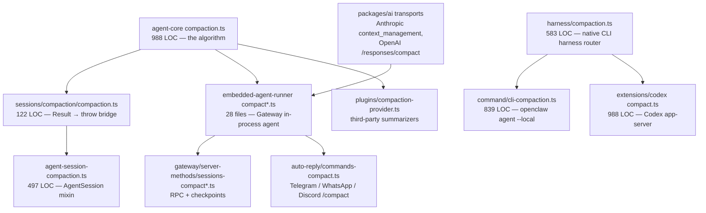

# Why OpenClaw compaction is 107 files and WriterAgent's is one module

**Date**: 2026-09-09
**Scope**: File layout of conversation compaction in [OpenClaw](https://github.com/openclaw/openclaw) vs the WriterAgent v1 design in [`compaction-dev-plan.md`](compaction-dev-plan.md). Numbers measured from a local OpenClaw tree (`Desktop/Python/openclaw`).
**Status**: analysis only — no code changes. The development plan is being edited separately; this document does not replace it.

This is the "why so many files" companion to the compaction plan. It does **not** restate the 8-step algorithm, the 70% trigger, or the WriterAgent call-site recipe. Those live in the plan.

> **TL;DR:** The 107-file figure is a `*compact*` filename glob over a multi-runtime product, not the size of the algorithm. Half of those hits are tests. The portable algorithm is one 988-line file. The rest is product surface WriterAgent does not have (Gateway RPC, Telegram `/compact`, Codex native harness, safeguard quality audits, successor transcripts, plugin providers, Anthropic/OpenAI *server-side* compact) plus TypeScript file-per-phase layering and compatibility barrels. WriterAgent already has one session, one HTTP client, and one send path, and it has a written rule against splitting those. So the same algorithm lands as **one new UNO-free module plus ~4 call sites**.

The same pattern showed up in the framework audit ([`openclaw-framework-debt-analysis.md`](../openclaw-framework-debt-analysis.md) §3.2): OpenClaw is disciplined, not sloppy. It pays for extra runtimes and extra indirection. WriterAgent has spent years putting related things in the same file so a feature like this does not have to invent a new tree.

---

## 1. The 107-file number is a glob, not a feature

The compaction plan quotes:

> OpenClaw's `*compact*` cluster under `src/agents` + `packages/agent-core` is **107 files / 46,864 LOC** (109 `find` hits including 2 directories).

That is a true `find -iname '*compact*'` over those two trees. It is **not** "compaction is a 47 kLOC feature." Split the same glob by production vs tests:

| Slice (`*compact*` under `src/agents` + `packages/agent-core`) | Files | LOC (`wc -l`) |
| --- | ---: | ---: |
| `find` hits including 2 directories | 109 | — |
| Files | **107** | **46,864** |
| Tests (`.test.ts`, `test-support`, fixtures, harnesses) | 54 | 31,925 |
| **Production** | **53** | **14,939** |
| Of which `embedded-agent-runner` | 21 + 7 under `run/` | 7,480 |
| Of which `agent-hooks` safeguard | 4 | 2,081 |
| Of which agent-core `compaction.ts` (the algorithm) | **1** | **988** |

Repo-wide, any file with `compact` in the name (excluding tests, docs, QA YAML, Swift UI) is **86 files / 23,308 LOC**. That glob is even less of a feature: it includes SQLite `VACUUM` doctor commands, Codex extension glue, Gateway RPC, auto-reply `/compact` for Telegram/WhatsApp, and Anthropic/OpenAI *server-side* compact transports.

Name collisions in that wider glob (not conversation compaction at all):

| File | What it actually is |
| --- | --- |
| `src/commands/doctor-sqlite-compact.ts` (158) | SQLite `VACUUM` / freelist reclaim |
| `src/commands/doctor-session-sqlite-compact.ts` (118) | Same, session DB |
| `src/commands/doctor-state-sqlite-compact.ts` (120) | Same, state DB |
| `scripts/lib/sqlite-reliability-compaction.ts` (258) | Same family |

The glob **also undercounts** the algorithm, because neighbors are not named `*compact*`:

| File | LOC | Role |
| --- | ---: | --- |
| `packages/agent-core/src/harness/compaction/utils.ts` | 295 | serialize conversation, file-ops, extract summary text |
| `packages/agent-core/src/harness/compaction/branch-summarization.ts` | 273 | branch / worktree summaries (not v1) |
| `packages/agent-core/src/harness/session/tool-result-pairing.ts` | 365 | keep tool_call + toolResult together |
| `packages/normalization-core/src/cjk-chars.ts` | 52 | chars/4 with CJK weight |

So: the 107 number is a search artifact. The question is why the *production* half is 53 files instead of 1.

---

## 2. The algorithm is already one file

`packages/agent-core/src/harness/compaction/compaction.ts` (988 lines) is the portable essence. Its public surface is the whole feature WriterAgent is porting:

| Export | Job |
| --- | --- |
| `estimateTokens` / `estimateContextTokens` / `calculateContextTokens` | chars/4 (+ image blocks, last-assistant usage) |
| `shouldCompact` | `contextTokens > contextWindow - reserveTokens` |
| `findCutPoint` / `findTurnStartIndex` | split that does not tear a tool pair |
| `generateSummary` / `SUMMARIZATION_SYSTEM_PROMPT` | one LLM call |
| `prepareCompaction` / `compact` | build the compacted view |
| `capCompactionSummary` | 16 k char safety rail |
| `DEFAULT_COMPACTION_SETTINGS` | `reserveTokens: 16384`, `keepRecentTokens: 20000` |

`shouldCompact` is 9 lines (267–275). The rest of that file is estimator + cut-point + prompts + apply.

WriterAgent v1 maps that file onto `plugin/chatbot/compaction.py`. Odysseus already did the same job in one Python file (`odysseus/src/context_compactor.py`, 527 lines). The 53-file remainder is **not more algorithm**. It is OpenClaw wrapping that file for every runtime it ships.

---

## 3. Five multipliers that turn 1 file into 53

### 3.1 Many products, many runtimes

OpenClaw is not a sidebar. Compaction has to work for all of these, each with its own transcript store and admission rules:

WriterAgent has **one** of those boxes: a LibreOffice sidebar `ChatSession` that already owns `messages`, already talks to `LlmClient`, and already spawns `_spawn_llm_worker`. There is no Gateway, no channel `/compact`, no native Codex/Claude CLI session to compact, no plugin summarizer registry, no server-side compact transport.

Each extra runtime is not a re-export. It brings real constraints:

| Runtime | Extra problem it exists to solve |
| --- | --- |
| Embedded agent runner | In-process Gateway agent; must queue onto a command lane, respect plugin generation scope, persist a transcript file, optionally spawn a *successor* session |
| Native CLI harness | Compaction is owned by `codex` / `claude` CLI (`ownsNativeCompaction`). Generic `compact()` is illegal when the model is locked to that harness (`lockedHarnessCompactionFailure` in `compact.ts` 64–73) |
| Auto-reply | `/compact` typed in WhatsApp has to resolve a session store path, a chat type, and a notice to send back |
| Gateway RPC | `sessions.compact` is a JSON-RPC method with protocol validation (`packages/gateway-protocol`) |
| Plugin provider | A third-party can replace `generateSummary` |
| `packages/ai` transports | Anthropic `context_management` and OpenAI `/responses/compact` are *server* compact, a different algorithm, still named `*compact*` |

WriterAgent v1 does none of that. The plan's non-goals list is almost a directory listing of OpenClaw's extra files.

### 3.2 File-per-phase TypeScript

Inside `src/agents/embedded-agent-runner/` alone there are **21 production compact files** (6,115 LOC) plus **7 more** under `run/` (1,365 LOC). They are not 28 algorithms. They are lifecycle phases split into files:

| Phase | Files | LOC |
| --- | --- | ---: |
| Public facade + types + lazy loader | `compact.ts`, `compact.types.ts`, `compact.runtime.ts` | 504 + 171 + **20** |
| Failure-reason classifier | `compact-reasons.ts` | 124 |
| Direct (in-process) path | `direct-compaction.ts` (**30**), `direct-compaction-preparation.ts`, `prepared-compaction-runtime.ts`, `compaction-session-execution.ts` | 30 + 382 + 680 + 701 |
| Queued path (command lane) | `compact.queued.ts`, `compact.queued-execution.ts` | 687 + 560 |
| Runtime plumbing | `compaction-runtime-context.ts`, `compaction-runtime-preparation.ts`, `compaction-session-agent.ts`, `compaction-safety-timeout.ts`, `compaction-diagnostics.ts`, `compaction-checkpoint.ts` | 373 + 255 + 129 + 165 + 99 + 69 |
| Product extras | `compaction-hooks.ts`, `compaction-successor.ts`, `compaction-duplicate-user-messages.ts`, `post-compaction-loop-guard.ts`, `server-endpoint-compaction.ts` | 384 + 369 + 97 + 195 + 121 |
| Pre-prompt / overflow inside `run/` | `preemptive-compaction.ts` + `.types.ts`, `compaction-runtime.ts`, `compaction-timeout.ts`, `compaction-retry-aggregate-timeout.ts`, `compaction-live-model-selection.ts`, `compaction-accounting-bridge.ts` | 544 + 8 + 554 + 122 + 73 + 40 + 24 |

`direct-compaction.ts` is a 30-line coordinator that calls prepare → build runtime → execute → dispose. `compact.runtime.ts` is a 20-line lazy `import("./compact.js")` so the Gateway can load compaction on demand. `preemptive-compaction.types.ts` is 8 lines. Those would be functions — or a `from .compaction import compact_session` — in WriterAgent.

The planning cluster next door is the same pattern: four files to optionally move summarizer chunking onto `worker_threads` so a 64-message history does not starve Node's event loop (`compaction-planning.ts`, `compaction-planning-projection.ts`, `compaction-planning-worker.ts`, `compaction-planning.worker.ts`, `compaction-planning-worker-runtime.ts`). WriterAgent estimates tokens with `len(text) // 4` on the existing LLM worker thread. There is no event loop to starve.

This is the same diffusion the framework audit measured for `src/process/` (15 files for what `worker_pool.py` does in one). Compaction is that pattern applied to a feature instead of to subprocesses.

### 3.3 Compatibility facades

OpenClaw extracted `packages/agent-core` as a library that returns `Result<T, Error>`. Callers that predate that still throw. So there is a dedicated bridge:

`src/agents/sessions/compaction/compaction.ts` (122 lines) — docstring: *"Local callers keep the historic throwing API while agent-core returns explicit Result objects."* It re-exports `shouldCompact` / `findCutPoint` / `estimateTokens` and wraps `compact` / `generateSummary` in `unwrapCompactionResult` (throw on `!ok`).

Then `agent-session-compaction.ts` (497) is an abstract mixin that talks to that bridge. Then `embedded-agent-runner/compact.ts` (504) is another facade that decides native-CLI vs direct vs queued. Then `compact.runtime.ts` lazy-loads *that*. Then `auto-reply/commands-compact.ts` and `gateway/server-methods/sessions-compact.ts` are two more entry facades.

WriterAgent does not have a library/app split inside the extension, does not have a historic throwing API to preserve, and does not lazy-load chatbot modules (LibreOffice already paid the import cost at sidebar create). There is nothing for those barrels to do.

### 3.4 Features WriterAgent explicitly deferred

The plan's non-goals are not "we might do these later as extra functions in `compaction.py`." In OpenClaw each one is already a file cluster:

| OpenClaw cluster | Prod files (named `*compact*`) | LOC | WriterAgent v1 |
| --- | ---: | ---: | --- |
| Safeguard mode + quality-audit retries (`agent-hooks/compaction-safeguard*.ts`) | 4 | 2,081 | Deferred. Default in OpenClaw is now `"safeguard"`; `compaction-safeguard.ts` is 1,485 lines with an `oxlint-disable max-lines` TODO to split it further |
| `/compact` slash + notices (`auto-reply/commands-compact.ts`, `compaction-notice.ts`) | 2+ | ~536 | Slash commands are stubs; v1 is silent except a drain `STATUS` line |
| Memory flush before compact (`memory-flush.ts`) | 1 (not in the glob) | 187 | Experimental `memory.py`; no silent extra agent turn |
| Successor transcripts (`compaction-successor.ts`) | 1 | 369 | No second session file |
| Checkpoints (`gateway/session-compaction-checkpoints.ts` + server-methods) | 3 | ~1,343 | In-memory `CompactionState` only |
| Plugin summarizer (`plugins/compaction-provider.ts`) | 1 | 9 (+ registry types) | Same chat model |
| Post-compaction tool-loop guard | 1 | 195 | Non-goal |
| Identifier policy / `summarizeInStages` / planning workers | 5 | ~1,092 | One non-streaming `request_with_tools` |
| Anthropic / OpenAI *server-side* compact (`packages/ai/src/transports/*compact*`) | 5 | 1,159 | Out of v1; see `responses-api-plan.md` |
| Context-engine watchdog | 1 | 34 | No context engine |
| Codex extension compact | 3 | 1,225 | No Codex app-server |

Turning `chat_compaction_enabled` off in WriterAgent also disables overflow retry. OpenClaw keeps preflight/overflow when `compaction.enabled` is false, which is why disable-logic is scattered across runner, auto-reply, and gateway instead of one `if not enabled: return`.

### 3.5 Node-only machinery WriterAgent does not need

Several compact files exist because OpenClaw runs on Node's single-threaded event loop plus a Gateway process:

- **Command-lane queueing** (`compact.queued.ts` 687, `compact.queued-execution.ts` 560) — compaction is a job that must not race other session work. WriterAgent already has `llm_request_lane` (a `threading.Lock`); the plan puts `compact_session` *inside* that existing `with` block.
- **`worker_threads` planning** — see §3.2. WriterAgent's estimator is cheap and already off the UI thread.
- **AbortSignal / aggregate timeout** (`compaction-timeout.ts`, `compaction-retry-aggregate-timeout.ts`, `compaction-safety-timeout.ts`) — Node cancellation tokens. WriterAgent already has `resolve_stop_checker()`.
- **Plugin generation scope** (`withPluginRuntimeGenerationScope` in `compact.ts`) — hot-reload safety for a plugin host. The extension does not hot-reload chatbot code.
- **Transcript file + SQLite session store** — OpenClaw persists a compaction *entry* into a session file (`type: "compaction"`). WriterAgent keeps originals in `session.messages` and history_db; the compacted view is a cache. That choice deletes the successor / checkpoint / transcript-writer files from the design.

The framework audit's punchline applies here too: OpenClaw does not have a UNO thread-affinity problem, so it spends its complexity budget on product topology instead.

---

## 4. What WriterAgent already has (so the new code stays small)

OpenClaw's compact files keep re-solving session identity, HTTP, concurrency, stop, and config because those concerns are spread across Gateway / auto-reply / harness / agent-core. WriterAgent already clustered them:

| Concern | WriterAgent (already exists) | OpenClaw compact files that re-bind it |
| --- | --- | --- |
| Session + messages | `ChatSession` in `panel.py` (1,565). Plan adds one field, `self.compaction` | `agent-session-compaction.ts`, `compaction-session-agent.ts`, `compaction-session-execution.ts`, successor, checkpoints |
| Send / tool loop | `tool_loop.py` (775) + `tool_loop_state.py` (581) + `tool_loop_actions.py` (325). One spawn path: `_spawn_llm_worker` / `_spawn_final_stream` | `run/preemptive-compaction.ts`, `run/compaction-runtime.ts`, post-compaction loop guard |
| HTTP / LLM | `LlmClient` (`llm_client.py` 1,257). Summarizer is `request_with_tools(stream=False)` on the same client | `compaction.ts` `generateSummary`, planning workers, live-model-selection, plugin providers |
| Concurrency gate | `llm_request_lane` in `_spawn_llm_worker` | `compact.queued.ts` + command-queue admission |
| Stop | `resolve_stop_checker()` | AbortSignal plumbing in timeout/safety files |
| Overflow vs death | `errors.py` already maps llama-server 500s; plan splits the predicates | `packages/ai/src/utils/overflow.ts` (247) + `failover/context-overflow.ts` (137) |
| Persistence | `history_db.py` (179). v1 does **not** rewrite rows | Session transcript writer, checkpoints, successor files |
| Config | `config_schema.py` + `get_config_bool_safe` | `DEFAULT_COMPACTION_SETTINGS` plus per-agent YAML plus plugin overrides |
| Librarian / Web | Separate `ChatSession` objects; same worker | Separate auto-reply vs embedded vs CLI paths |

The plan's ~4 production call sites are exactly the seams that already exist:

1. **`plugin/chatbot/compaction.py`** (new) — estimator, cut, summary, view, overflow predicates.
2. **`plugin/chatbot/panel.py`** — `ChatSession.compaction`; `clear()` resets it.
3. **`plugin/chatbot/tool_loop.py`** — compact inside the existing lane; send `messages_for_llm`; `_handle_stream_error` respawns with `force_compact=True`.
4. **`plugin/framework/config_schema.py`** — `chat_compaction_enabled: bool = True`.

No new session type, no new HTTP client, no new queue kind, no new FSM event. That is the payoff of the clustering work.

---

## 5. WriterAgent's written "put it together" rule

This is not an accident of a smaller product. The repo tells agents not to split these files.

Root [`AGENTS.md`](../../AGENTS.md):

> When asked to do a new feature, always figure out the way using the least amount of code or extra complexity. Using existing functions, there are many functions which can just be used or refactored to make the change small for a new feature.

[`plugin/chatbot/AGENTS.md`](../../plugin/chatbot/AGENTS.md):

> File ownership (existing modules; no new panel/dialog/session files)
>
> `send_handlers.py` / `tool_loop.py` — mixins on `SendButtonListener`. […] Stay mixins (no `session.py` / `send.py`).

The tool-loop *was* split, once, along a real axis: `tool_loop.py` (UNO/I/O spawn), `tool_loop_state.py` (pure `next_state`), `tool_loop_actions.py` (effects). That is three files for a hard invariant ("keep the chat FSM pure"), not 28 files for lifecycle phases of one call. Compaction is not a second FSM. It is a function the existing worker calls before `stream_request_with_tools`.

Putting `compaction.py` under `plugin/chatbot/` (not `plugin/framework/`) is the same rule: it builds a view of session messages, so it lives next to `ChatSession`, and it stays importable without UNO so pytest can mock `LlmClient`.

OpenClaw's equivalent rule, in practice, is the opposite: extract a package (`agent-core`), keep the old throwing API (`sessions/compaction/compaction.ts`), add a mixin (`agent-session-compaction.ts`), add a runner facade (`compact.ts`), lazy-load it (`compact.runtime.ts`), queue it (`compact.queued.ts`), and expose it on every product surface. Each step is locally reasonable. The sum is 53 production files.

---

## 6. Mapping: OpenClaw cluster → WriterAgent destination

| OpenClaw (prod `*compact*` unless noted) | Files / LOC | WriterAgent v1 |
| --- | --- | --- |
| `packages/agent-core/.../compaction.ts` + `utils.ts` + `cjk-chars.ts` + `tool-result-pairing.ts` | ~1,700 | **`plugin/chatbot/compaction.py`** (estimator, cut, summary, `sanitize_tool_pairs`, CJK fast path) |
| `agent-compaction-constants.ts` | 1 / 30 | Constants at top of that module (`MAX_OVERFLOW_COMPACTION_ATTEMPTS = 3`, keep-recent caps) |
| `src/agents/compaction.ts` + planning* + planning-worker* | 6 / ~1,487 | **Omit** staged/worker summarizer. One `request_with_tools` |
| `sessions/compaction/compaction.ts` Result→throw bridge | 1 / 122 | **Omit**. Python raises or returns `CompactResult` |
| `agent-session-compaction.ts` | 1 / 497 | One field on `ChatSession` |
| `embedded-agent-runner` compact cluster | 28 / 7,480 | **`compact_session()` inside existing `llm_request_lane`** |
| `harness/compaction.ts` native CLI router | 3 / 834 | **Omit**. No Codex/Claude CLI session |
| `command/cli-compaction.ts` | 2 / 924 | **Omit** |
| `auto-reply` `/compact` + notice | 5 / 844 | Drain `STATUS` line only; no slash command in v1 |
| `gateway` RPC + checkpoints | 5 / 2,002 | **Omit** |
| `agent-hooks` safeguard | 4 / 2,081 | **Omit** |
| `packages/ai` server-side compact | 5 / 1,159 | **Omit** (possible later via responses-api-plan) |
| `failover/context-overflow.ts` + `packages/ai/.../overflow.ts` | 2 / 384 | `is_context_overflow_error` / `is_process_death_error` in `compaction.py`; keep `local_model_overflow_message` for death |
| `memory-flush.ts` | 1 / 187 | **Omit** |
| `plugins/compaction-provider.ts` | 1 / 9 | **Omit** |
| `extensions/codex` | 3 / 1,225 | **Omit** |
| Doctor SQLite `*compact*` | 3+ / ~700 | Unrelated; ignore |
| Tests in the 107 glob | 54 / 31,925 | `tests/chatbot/test_compaction.py` plus a few cases in `test_chat_session.py` / `test_tool_loop_errors.py` (~300–500 LOC, not 32k) |

The plan's "portable essence = 8 files / 2,503 LOC" is the right *read* list for implementing `compaction.py`. It is not the right *file budget* for WriterAgent. After you drop the Result bridge, the planning workers, and memory-flush, the essence that must exist in Python is the agent-core 988 + CJK 52 + pairing sanitizer ~20 + overflow predicates ~80.

---

## 7. Verdict

OpenClaw does not need 107 files to compact a conversation. It needs 107 filename hits because:

1. The glob counts tests, directories, and unrelated SQLite `VACUUM` helpers.
2. The remaining production files wrap **one** 988-line algorithm for every runtime OpenClaw ships (embedded Gateway agent, native CLI harness, auto-reply channels, Gateway RPC, Codex extension, plugin providers, Anthropic/OpenAI server compact).
3. Inside the embedded runner, TypeScript style splits each lifecycle phase into its own file, including 8-line type files and 20-line lazy-import barrels.
4. Compatibility barrels exist to preserve a throwing API after `agent-core` moved to `Result`.

WriterAgent can implement the same algorithm in one module because the surrounding machinery is already clustered (`ChatSession`, `LlmClient`, `tool_loop`, `llm_request_lane`, `history_db`, Stop, config), because v1 refuses the extra product surfaces, and because the project has an explicit rule not to invent `session.py` / `send.py` / a second HTTP client for a feature that already has a home.

Do not "fix" WriterAgent toward OpenClaw's file count. The 1-module design is the feature. If compaction later needs `/compact` or a Settings checkbox, add a function and a call site — not a `plugin/chatbot/compaction/` package.

---

## References

- WriterAgent design: [`compaction-dev-plan.md`](compaction-dev-plan.md) (do not treat this analysis as a substitute).
- OpenClaw user docs: `openclaw/docs/concepts/compaction.md`, `openclaw/docs/reference/session-management-compaction.md`.
- Same diffusion pattern, different subsystem: [`openclaw-framework-debt-analysis.md`](../openclaw-framework-debt-analysis.md) §3.2 (`src/process/` vs `worker_pool.py`).
- WriterAgent clustering rules: [`AGENTS.md`](../../AGENTS.md) (least complexity), [`plugin/chatbot/AGENTS.md`](../../plugin/chatbot/AGENTS.md) (file ownership).
- In-tree 1-file prior art: `odysseus/src/context_compactor.py` (527).
