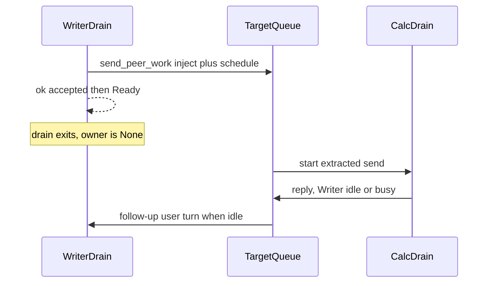
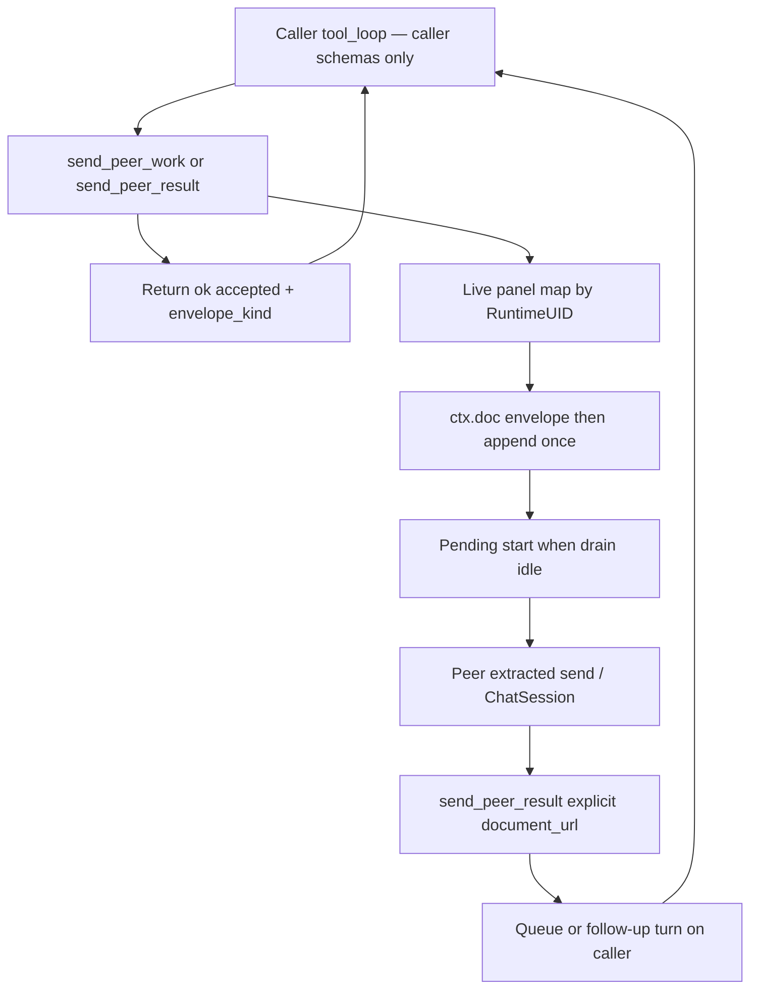

# Cross-app sidebar peer messaging (Writer ↔ Calc ↔ Draw ↔ Impress)

**Status:** A1 inject/queue/envelope on `master` (#672). Specialized-inner + two-tool polarity landed via **#814** (`send_peer_work` / `send_peer_result`; outer never advertises them). Headed Scenarios 2/4/5 HAPPY; Scenario 8 PARTIAL — see [§5.1](#51-headed-status-and-open-issue-2026-09-20).  
**One-liner:** four peers (Writer / Calc / Draw / Impress), A1 async `send_peer_work` / `send_peer_result` (kind = which tool), **document_research specialized only** (not outer chat, not MCP), pre-open only, GMP via a staged Draw/Writer form (not a PDF product claim), no spawn.

**Assumption:** Writer, Calc, Draw, and Impress documents are already open in **one LibreOffice process** / one WriterAgent extension. Talk-to-already-open is enough for SAR/floorstand (Writer ↔ Calc), GMP (Writer ↔ Draw), and Writer↔Impress / Calc↔Impress. Creating or spawning a peer mid-session is later product polish.

This is **not** an IPC problem and **not** a blocking inner-agent RPC. The product center is: one sidebar **sends a natural-language turn into another already-open sidebar**, as if the user typed there. The send tool **returns immediately**. The peer, when done, **sends back** via `send_peer_result`. No `ToolContext` rebind on the caller. No schema union. **Not on MCP.**

---

## Current decisions (v1)

Recorded 2026-09-08. Implement these; do not implement the older “don’t Ready” / fail-fast-busy text.

| Decision | Current v1 |
| -------- | ---------- |
| **Name** | `send_peer_work` + `send_peer_result` (replaces `send_peer_message`; not `ask_peer_*`). |
| **Surface** | **Experiment:** `document_research` specialized only (not outer/main schemas). Tier `"chat"` still hides MCP `tools/list` / `find_tools`. `execute()` allows sidebar `caller=="chat"` **or** `active_domain=="document_research"`; MCP/script stay refused. Master/#672 advertised the tool on main chat — do not restore that as this experiment’s default. |
| **Shape** | `send_peer_work(document_url, message)` and `send_peer_result(document_url, message)`. Required `document_url` every call. Kind = which tool was called. `document_url` is the **one** target arg: file URL, RuntimeUID, or a display `name` that matches **exactly one** open peer. No correlation id. No separate `name` parameter. No `reply=true`, no `last_peer_from`. |
| **Return** | `{"status": "ok", "accepted": true, "envelope_kind": "work"|"result"}`. FSM success is `status == "ok"`; do **not** return `status: "accepted"` alone. `is_mutation = False`. |
| **Sender** | Derived from `ToolContext.doc` (`get_runtime_uid`, display name, file URL). Not authored in `message`. `ToolContext` has no frame. |
| **Ready** | After `ok`/`accepted`, the caller **Readys** (local work first is OK). Do **not** teach “don’t Ready until the reply.” Reply is a **follow-up user turn** when the caller is idle. SAR/GMP are **two caller turns**. |
| **Drain** | One UI thread; each send is a blocking drain. **Inject now, start later.** Do not start the peer drain from caller `execute()` or via `QueueExecutor.post` while `get_drain_owner()` is set — that nests (`"stream"` same-owner is allowed) and freezes the caller (A1 becomes accidental A2). Kick pending starts when drain depth hits 0. |
| **Busy** | Queue-on-listener for **all** busy targets (outbound and replies). Not fail-fast. Policy in [§4.3](#43-live-panel--busy--queue--deck). |
| **Kind** | Which tool was called stamps the envelope: work → `[Peer work from: …]`, result → `[Peer result from: …]`. No correlation id. Host does **not** splice the reply onto the originating tool result. Routing is `document_url` → that session, like any other send. |
| **Discoverability** | `list_open_documents` stays `tier="mcp"` (off the chat wire). When this tool is visible, bake the open-peer catalog (name / uid / url / type) into the tool description and a short prompt block. |
| **Impress** | In v1. Research catalog `doc_type: "draw"` still folds Impress (`impress_as_draw=True`). Peer catalog uses an explicit `type: "impress"` from `PresentationDocument` on the **resolved model** (checked before `DrawingDocument` so Draw-only stays `draw`). |
| **Lock** | No extra per-doc lock in v1. Sidebar chat does not take MCP’s uid gate. |
| **Focus** | No `toFront`, no `query.setFocus` on the extracted send. |

**Shipped on master (#672):** A1 inject / queue / envelope / live panels / Ready-after-accepted / explicit `document_url` / chat execute path. That main-wire stays on `master`.

**Specialized-inner (#814 on master):** outer/main schemas never list peer send tools (even when peers are open). Outer prompt is a thin DO: delegate `document_research` for sibling work. After that inner send is accepted (or the answer says waiting for a peer reply), the **outer Readys** — do not start more `document_research` / python / query tools in the same turn. On a `[Peer work from: …]` envelope: do local work (nested domains like `ranges` OK), then you **MUST** still `{delegate}(domain="document_research")` to deliver via `send_peer_result` — finishing `ranges`/`sheets`/… alone is not delivery. Work envelopes append a fixed delivery footer; specialize returns may stamp `PEER_OUTER_DELIVERY_STILL_REQUIRED` when a Peer-work turn finished without `send_peer_result`. On a `[Peer result from: …]` envelope: apply/insert locally and stop — no ack specialize. Inner ask vs reply is selected **only** by a `[Peer work from: …]` envelope in the specialize task (asker never `send_peer_result` / never silent `delegate_read_document` on an open peer). The document_research subagent is the only loop that calls `send_peer_work` / `send_peer_result`. After `ok`/`accepted` it **must** `specialized_workflow_finished` immediately — waiting deadlocks the peer. MCP stays refused.

**Still later (kept, not v1):** A2 blocking `ask_*` / silent fallback; multiplexed drain + mid-loop `PEER_REPLY`; waiting chrome; last-sender default; MCP exposure; spawn; PDF/AcroForm. See [§3](#3-candidate-designs) and [§3.1](#31-alternatives-considered--kept). Do **not** sneak Ready-hold back in — that deadlocks the queue.



---

## 1. Problem framing

A user (or an eval harness) has two or three windows open in the same LibreOffice process. Each window has (or can have) its own WriterAgent sidebar.

| Instance | Bound document | Main-chat tool surface | Chat loop |
| -------- | -------------- | ---------------------- | --------- |
| Writer sidebar | That Writer model (`frame.getController().getModel()`) | Writer **core** tools + `delegate_to_specialized_writer_toolset` | `ChatSession` + `ToolCallingMixin` |
| Calc sidebar | That Calc model | Calc **core** tools + `delegate_to_specialized_calc_toolset` | A **second** `ChatSession` + `ToolCallingMixin` |
| Draw sidebar | That Draw model (`com.sun.star.drawing.DrawingDocument`) | Draw **core** tools + `delegate_to_specialized_draw_toolset` | A **third** `ChatSession` + `ToolCallingMixin` |
| Impress sidebar | That Impress model (`com.sun.star.presentation.PresentationDocument`; also supports `DrawingDocument`) | Same Draw **core** tools + `delegate_to_specialized_draw_toolset` | A **fourth** `ChatSession` + `ToolCallingMixin` |

They already share the process: one `ToolRegistry` (`plugin.main.get_tools()`), one `ServiceRegistry` (`get_services()`), one UNO Desktop, one `LlmClient` stack, one history DB file, one memory/skills directory. What they do **not** share is a conversation or a tool schema. Each send builds schemas for **that** `doc_type` and executes tools against **that** `ToolContext.doc`.

**What the user wants:** the Writer agent can send the Calc agent Calc work, or the Draw agent Draw work (and any reverse), in natural language. The other sidebar **shows the message and runs it**. A reply comes back later on the caller’s transcript as a **new user turn**. Writer never advertises `write_formula_range` or `shape_upsert`; Calc never advertises `apply_document_content`.

**What this is not:**

- A long-running `ask_*` that waits for a compact inner-loop result (optional later wrapper — see [§3 A2](#a2-demoted--optional-later--documented-escape-hatch)).
- Rebinding the caller’s `ToolContext` to the peer document.
- Switching Writer ↔ Calc ↔ Draw tools inside one agent loop (in-place `active_specialized_domain` is for **same-app** domains).
- Unioning peer write tools onto the caller’s wire schemas.
- Turning `document_research` into a writer. Sibling reads stay read-only (`ToolContext.read_only_target`, `READ_ONLY_TARGET`).
- A new inter-process or in-process message bus (queues, sockets, `storeToURL`, udprops-as-mail, file-drop). The listener queue in [§4.3](#43-live-panel--busy--queue--deck) is “pending user turns on a sidebar,” not a product mailbox.
- Opening, creating, or spawning a peer mid-session. No matching open peer → **error**, not a silent create.
- Product PDF editing or an AcroForm API. See [§4.7](#47-gmp-staging--not-a-pdf-product).
- An MCP tool. External hosts keep using MCP `tools/call` on **that** document; they do not drive peer-to-peer sidebar turns.

The product move: **`send_peer_work(document_url, message)` / `send_peer_result(document_url, message)`** queue one user-equivalent turn on the peer sidebar and return `{status: ok, accepted: true}`. The caller puts **only** the task in `message` — never the source URL. The gateway derives the sender from **`ctx.doc`** and prepends a code-inserted envelope whose kind matches the tool. The peer’s extracted send path does the work **after** the caller drain exits. When finished, the peer calls **`send_peer_result`** with an **explicit** `document_url` copied from that envelope. No correlation id. No last-sender default — with 3+ docs, “whoever messaged last” is the wrong target under fan-in.

Any of the four can initiate. Writer as first sender is the usual SAR/GMP shape; Calc ↔ Draw / Writer ↔ Impress is the same tool.

---

## 2. Inventory of reusable infra

Cite these. Do not invent a bus. v1 copies the **sidebar send path**, not specialized-delegation’s blocking inner smol loop.

### 2.1 Main sidebar send (the pattern to copy)

This is user-send equivalence.

| Piece | Symbol / path | What it already does |
| ----- | ------------- | -------------------- |
| Per-document session | `ChatSession` in [`plugin/chatbot/panel.py`](../../plugin/chatbot/panel.py) | One transcript per sidebar. `active_specialized_domain` is **session-local**. History via `get_chat_history(session_id)`. |
| Send entry | `SendButtonListener._do_send` → `ToolCallingMixin._do_send_chat_with_tools` | Reads the Ask box, clears it, `setFocus`, may route to librarian/image. **Wrong entry for inject.** See [§4.9](#49-implementation-map). |
| Extract target | `_do_send_chat_with_tools(query_text, model, doc_type)` in [`plugin/chatbot/tool_loop.py`](../../plugin/chatbot/tool_loop.py) | Already takes text, refreshes `[DOCUMENT CONTENT]`, **also** `add_user_message`. Gateway must not wrap *and* call this, or the user turn double-posts. |
| Busy | `sidebar_state.send.is_busy` ([`send_state.py`](../../plugin/chatbot/send_state.py)); also `_active_q`, `_send_cancellation` | `SEND_CLICKED` while busy is a silent no-op — do not use that as the error path. |
| Tool context per call | `build_tool_execute_fn` in [`plugin/chatbot/tool_loop_actions.py`](../../plugin/chatbot/tool_loop_actions.py) | Builds `ToolContext(doc=…)` for **that** sidebar’s doc. No frame / listener / session on `ToolContext`. The caller of send_peer_work/send_peer_result does not rebind this. |
| Frame → model | `_get_document_model` → `get_document_from_frame` | Sidebar stays on **its** window. Envelope sender uses `ctx.doc` (same model). |
| FSM | `next_state` in [`plugin/chatbot/tool_loop_state.py`](../../plugin/chatbot/tool_loop_state.py) | Pure. Success is `status == "ok"` or `success is True`. No inject-user-message event. |
| Schema filter | `ToolRegistry.get_schemas("openai", doc_type=…)` | Default excludes `specialized`, `specialized_control`, `mcp`. Precedent: `filter_vision_delegate_schemas` in [`plugin/framework/tool.py`](../../plugin/framework/tool.py). |
| Live panels | Production `WeakValueDictionary` uid → panel in [`plugin/doc/live_panels.py`](../../plugin/doc/live_panels.py); debug `WeakSet` remains for tests | Register after `_wire_buttons`. Tool reads the map — [§4.3](#43-live-panel--busy--queue--deck). |

Draw already registers a sidebar deck (`DrawingDocument` in `extension/registry/.../Sidebar.xcu`; Impress is also on that ContextList). A1 still needs that deck **constructed once** so a live panel exists.

### 2.2 Open-doc addressing (already shipped)

| Piece | Symbol / path | Relevance |
| ----- | ------------- | --------- |
| Open-doc catalog | `get_open_documents` in [`plugin/doc/document_research.py`](../../plugin/doc/document_research.py) | Desktop components → `{name, url, uid, path, doc_type, is_active, modified}`. Main-thread only (`assert_main_thread`). |
| Resolve open model | `resolve_document_by_url` in [`plugin/framework/uno_context.py`](../../plugin/framework/uno_context.py) | File URL **or** `RuntimeUID`. Open components only — does **not** `loadComponentFromURL`. Returns `(model, doc_type)` with Impress labeled `"draw"` (`impress_as_draw=True`). |
| RuntimeUID | `get_runtime_uid` in [`plugin/framework/uno_context.py`](../../plugin/framework/uno_context.py) | Exists for untitled docs; `""` if unavailable. Two views of one model share one uid. |
| Write guard | `ToolRegistry.execute` when `ctx.read_only_target` | Research mutations → `READ_ONLY_TARGET`. Do not relax this. |
| MCP lister | `list_open_documents` (`tier = "mcp"`) | **Not** on the chat wire. Do not promote it to core for this feature. |

Docs: [multi-document-dev-plan.md](multi-document-dev-plan.md). Phase 0 decision #4: write-back to siblings is **out of scope** for research. Peer messaging is a **different** feature: writes happen because the **peer sidebar** ran a normal user turn on **its** bound doc.

### 2.3 Specialized delegation (contrast — A2 only)

`DelegateToSpecializedBase` + `build_toolcalling_agent` + `SmolAgentExecutor.execute_safe` is the closest shipped “task in, compact result out” loop. Writer / Calc / Draw already have `delegate_to_specialized_*` (`DrawingDocument` + `PresentationDocument` on the Draw gateway).

That path **rebinds** a fresh `ToolContext` and **blocks** the caller tool until `specialized_workflow_finished`. It is the right shape for **A2** (optional later / documented escape hatch). It is **not** v1. Draw is already first-class on this path; A1 does not need a Draw-specific send factory — same panel map + extracted send as Calc.

`document_research` / `run_inner_read_agent` also rebind `ToolContext` (read-only allowlist, including Draw `list_pages` / `get_draw_tree`). Keep that for sibling **reads**. Do not flip `read_only_target` to implement peer writes.

### 2.4 Other “handoffs” (weaker fit)

| Piece | Why people reach for it | Why it is not the design center |
| ----- | -------------------------- | -------------------------------- |
| MCP `tools/call` + `document_url` | External host can target any open doc | Loopback HTTP is not two sidebars chatting. v1 **does not** advertise or execute this tool for MCP. MCP already pops `document_url` as the *caller* doc — another reason not to share this name on that wire. |
| MCP result toast | `_on_mcp_result` posts onto **a** sidebar | External call display, not a peer send. |
| `EventBus` | Sync pub/sub | Process events, not a conversation. |
| `history_db` / memory / skills | Shared disk | Persistence ≠ a turn. Mixing app tool traces in one session is the anti-pattern. |
| udprops | Already stores `WriterAgentSessionID` | Identity, not a mailbox. |
| Collabora / coolwsd | Kit IPC | Different product — [§6](#6-non-goals). |

### 2.5 Threading (v1 constraint)

Colors from [uno-thread-safety.md](../framework/uno-thread-safety.md): **RED** = main/UNO, **BLUE** = workers, **YELLOW** = sync host dispatch.

Keep both peer send tools **`is_async=False`** so `execute()` runs on the caller’s drain thread (RED). Resolve / inject stay on RED without marshal. `long_running` is MCP-only and unused here.

**Two sidebars cannot drain in parallel** on today’s pump. [`run_stream_drain_loop`](../../plugin/framework/async_stream.py) takes [`drain_owner_scope("stream")`](../../plugin/framework/async_drain_guard.py). Same owner name **nests** (depth++); a different name **raises**. `pump_ui_idle` always pumps VCL. If caller `execute()` starts (or posts into the live pump) the peer’s `_run_send_drain` → `_do_send_chat_with_tools` → `_start_tool_calling_async`, the inner drain runs to completion **before** `execute()` returns. That is accidental A2.

v1: **inject** envelope + body onto the peer session (and UI line) on RED; **schedule** the peer extracted send on a pending-start list; return. When drain depth hits 0, start at most one pending send. If that target is busy, it stays on that listener’s queue ([§4.3](#43-live-panel--busy--queue--deck)).

Do **not** nest `_do_send_chat_with_tools` / `_start_tool_calling_async` on the **caller** listener. Do not reuse the caller’s `SendCancellation` for the peer (Stop on Writer must not cancel Calc HTTP). Each listener has its own `QueueExecutor` + `LlmClient` + `ChatSession`. Process-wide `llm_request_lane` serializes overlapping HTTP; less of an issue if peer work starts after the caller Readys.

---

## 3. Candidate designs

### A1. Current v1 — Async user-send into the live peer sidebar

One **chat-tier** tool, advertised only when a **resolvable other peer** exists ([§4.2](#42-tool-visibility)).

- **Names:** `send_peer_work` and `send_peer_result`. Replaces `send_peer_message`. Not `ask_peer_agent`.
- **Args:** `document_url` = **target** only (file URL, RuntimeUID, or a display name that matches exactly one open peer) — **required on every call**. No separate `name` parameter. `message` = NL body only. Replies use `send_peer_result` (kind from the tool). There is no correlation id, no `reply=true`, and no `last_peer_from` default ([§4.1](#41-envelope-and-correlation)).
- **Caller must not put a from-url in `message`.** Source identity is automatic ([§4.1](#41-envelope-and-correlation)).
- **Behavior:** Do **not** change the caller’s schemas or `ToolContext.doc`. Resolve an **open** supported peer. Find that uid’s live panel / `SendButtonListener`. Gateway builds the envelope from **`ctx.doc`**, prepends it to `message`, injects on the peer session, **schedules** that host’s extracted send, returns immediately `{status: "ok", "accepted": true, "envelope_kind": …}`.
- **Reply:** the peer later calls `send_peer_result` with `document_url` = the envelope’s from uid/url. Same inject + schedule onto the **caller** session (result envelope). Prompt + protocol **require** the reply; do not hope the peer mentions it in passing. Delivery is a follow-up user turn when idle ([Current decisions](#current-decisions-v1)).

No schema union. Each sidebar keeps its own tools because each send runs on **that** host.

### A2. Demoted — optional later / documented escape hatch

Fresh peer-context smol loop: `ToolContext` rebound to the peer model, `get_tools` for that `doc_type`, block until `specialized_workflow_finished`. Same retarget pattern as `run_inner_read_agent` (Calc and Draw are the same factory). Useful if the peer deck was never built or as a later **sync wrapper** (`ask_*` that waits).

**v1 must not silently fall back to A2.** If A2 is ever shipped, document it as an explicit escape hatch (setting or distinct behavior), not as a quiet substitute for “open the peer sidebar once.”

A2 is also the shape you get **by accident** if the peer drain starts on the caller stack ([§2.5](#25-threading-v1-constraint)). That is a bug, not a fallback.

### B–E. Discarded (unchanged reasons)

- **B.** Calling the other app’s `delegate_to_specialized_*` from Writer fails `tool_supports_document` / wrong `ctx.doc`. That gateway is “specialized domains **of this** document.”
- **C.** In-place Writer↔Calc↔Draw tool switch on one `ChatSession` mixes histories and schemas. `document_research` already refuses in-place mode.
- **D.** Write-enabling research. Trust model in [multi-document-dev-plan.md](multi-document-dev-plan.md) stays read-only on siblings.
- **E.** MCP / EventBus / udprops / files / Collabora as the **message**. Keep MCP for **external** hosts calling ordinary document tools. v1 does **not** expose peer send tools on MCP (not “call by name later”).

### 3.1 Alternatives considered (kept)

Reviewed against the current send/drain code. Not v1; do not delete — we may revisit.

| Alternative | What it is | Why not v1 |
| ----------- | ---------- | ---------- |
| Fail-fast on busy (older A1 text) | Tool error if the target listener is in a send | Reply is lost if Writer has not Ready’d yet. Replaced by queue-on-listener. |
| “Don’t Ready until reply” | Prompt the caller to stay in the loop | After `{accepted}` the FSM immediately continues (`TOOL_DONE` → next tool or LLM). No wait tool. Staying busy **deadlocks** the queue (queue only drains when idle). |
| Mid-loop inject (`PEER_REPLY` FSM) | Splice the reply into the **current** caller drain and spawn another LLM round | Needs a new FSM event, inject-only-between-rounds, and Ready-hold for outstanding ids. Also needs Calc to **run** while Writer’s drain is still open → multiplex or nest. Nest is A2. |
| Multiplexed drain | One `processEventsToIdle` owner, two queues | Real parallel two-sidebar turns. Large streaming project. Required for a true one-turn wait. |
| Waiting chrome | Drain exits (so the peer can run) but UI says “Waiting for peer…” then auto-starts the follow-up | Product sugar on top of current v1. Can add later without changing the tool. |
| Blocking `ask_peer` | Caller tool waits for a compact peer result | Contradicts A1. Same as shipping A2 as the center. |

---

## 4. Recommended approach (A1 async)

**Product (this experiment):** a chat-tier **peer-send** tool on the **document_research** specialized loop (Writer / Calc / Draw / Impress), **only when** a resolvable other v1 peer is open. Outer chat stays thin and delegates. The inner agent queues a user-equivalent turn on the peer sidebar and finishes so the outer can **Ready**. The peer replies with the same tool; that injects as a follow-up user turn. No loop grows foreign write tools.

**Implementation center:** production live-panel map + envelope injection + extracted non-click send + pending-start / per-listener queue. Do not build a bus. Do not rebind the caller’s `ToolContext`.

### 4.1 Envelope and correlation

**Tool shape (v1):** `send_peer_work(document_url, message)` and `send_peer_result(document_url, message)`. No correlation id.

- `document_url` addresses the **peer**. It is the **one** target argument: a file URL, a RuntimeUID, or a display `name` that matches **exactly one** open peer. Do **not** add a separate `name` parameter. It is never “who I am.”
- `message` is the NL body only. Prompts must tell the model **not** to paste its own path, uid, or URL into `message`. LLMs will get that wrong; the gateway always has `ctx.doc`.

**Sender is derived, not authored.** On `execute`, read the **caller** bound model (`ctx.doc`): display **name**, `RuntimeUID`, and file URL if the doc is saved (untitled → empty url, uid still required). Build a one-line envelope in **code**, then the body. Inject so the peer transcript and the send path see the same wrapped user turn:

```text
[Peer work from: Budget 2026.ods | uid=… | url=file:///…]

Compute Q4 revenue by region and reply with an HTML table.
```

Layout: `[Peer work from: Name | uid=… | url=…]` for `send_peer_work` (gateway appends a fixed delivery footer: after local work, Do `domain="document_research"` to deliver via `send_peer_result` with the asker's uid/url from the header); `[Peer result from: Name | uid=… | url=…]` for `send_peer_result` (body only — no footer). No correlation id. Body is `message` after a blank line. The wrapper is not model-written.

**Outbound `execute` (immediate, RED, `is_async=False`):**

1. Refuse MCP/script. Allow `caller=="chat"` or `active_domain=="document_research"`.
2. Resolve **target** from required `document_url`. Fail if missing / none / ambiguous / unsupported ([§4.2](#42-tool-visibility), [§4.4](#44-addressing)). Do not default to a last sender.
3. Look up the live panel by uid. Missing → error: open the peer sidebar once. No A2.
4. Stamp envelope kind from which tool was called (`work` vs `result`). No correlation id — concurrent peers use explicit `document_url`.
5. Derive sender from `ctx.doc`. Prepend the envelope to `message`. Append **once** on the peer session + UI line (do not also call `_do_send_chat_with_tools`’s append).
6. Enqueue / schedule that host’s extracted send ([§4.3](#43-live-panel--busy--queue--deck)). Do **not** wait for it to finish. Do **not** start a drain on this stack.
7. Return `{"status": "ok", "accepted": true, "envelope_kind": "work"|"result"}` to the **caller** tool (same turn). This is not a compact task result.

**No last-sender default.** Do not store `last_peer_from` or accept `reply=true` to omit `document_url`. With three (or more) open docs, fan-in means “whoever messaged last” is often the wrong peer. The inbound envelope already has name / uid / url. The model copies uid/url into `send_peer_result`. Missing `document_url` → tool error (do not guess).

**Reply delivery:**

- Symmetric `send_peer_result(document_url=<from envelope>, message=…)` with a fresh **caller-doc** result envelope **is** the injection. Host routes to that uid’s session (same as any send). Then that host’s extracted send when idle / drain-free.
- Prompt + protocol: when you finish the asked work, **you must** `send_peer_result` back to the envelope’s from uid/url and say what you completed. Do not rely on the peer happening to narrate in its own sidebar only.

**Caller Ready:** teach **Ready** after `accepted` (local work first is OK). The reply arrives as a follow-up user turn. If the caller is still busy, the reply **queues** — it is not dropped.

### 4.2 Tool visibility

**Experiment visibility:** advertise both peer send tools on `get_schemas` **only** when `active_domain` is `document_research` **and** `get_open_documents` has at least one **resolvable other v1 peer**. Outer/main (`active_domain` empty) never lists the tool. Specialized `get_tools` uses the same peer-exists gate (`filter_peer_tools_for_specialized`).

Peer-exists rules (unchanged from #672):

- Different RuntimeUID than self (not two views of the same model).
- Supported v1 service on the **resolved model**: `TextDocument` / `SpreadsheetDocument` / `DrawingDocument` / `PresentationDocument`. Peer type is `impress` when the model supports `PresentationDocument` (checked before `DrawingDocument`).
- Addressable (`url` or `uid`).
- Skip `get_runtime_uid == ""`.

Hide when alone. Hide when the only other components are Start Center or unresolvable. Two Writer documents with distinct uids **do** count (Writer↔Writer is a legal pair). Do **not** show the tool merely because two components exist if you cannot name a supported non-self uid.

Same idea as `filter_vision_delegate_schemas`: filter at schema time, not only at `execute`. Re-evaluate each caller send (open set changes). `get_open_documents` is main-thread; chat `get_schemas` already runs on the UI thread.

**Catalog for the model:** when visible, the schema description (and a short prompt block) lists those peers: `name`, `uid`, `url`, type. The model cannot call `list_open_documents` from chat.

### 4.3 Live panel, busy, queue, deck

**Live panel map (v1):** process-wide weak map keyed by `get_runtime_uid(model)` for Writer, Calc, Draw, and Impress. **Not** the debug `WeakSet` (gated / stripped in release).

- Leaf module, e.g. [`plugin/doc/live_panels.py`](../../plugin/doc/live_panels.py) (name illustrative). `panel_factory` **registers** after `_wire_buttons` (need `send_listener`). The tool **reads** the map. Do not import `panel_factory` or `panel` from the tool module (cycle: `CommonModule` → tool → `panel` → `get_tools()`). Chatbot AGENTS.md: send / `tool_loop` must not import `panel_factory`.
- Skip register when uid is `""`.
- Value: `ChatPanelElement` (has `send_listener`, frame, session) or a small handle with those. Two windows of the same model → **last-write-wins** (one uid). Accept for v1.
- `disposing` is unreliable; rely on weak values.

**Deck not built:** LibreOffice may not construct the Calc/Draw (or Writer) deck until the user opens it. Open doc ≠ live panel. **Error** (clear, user-facing): open the peer sidebar once. **No silent A2 fallback** in v1.

**Busy + queue (v1):** if that listener is in a send / drain (`sidebar_state.send.is_busy`, `_active_q`, or `_send_cancellation`), **enqueue** the wrapped turn. Same for a target that is idle but the **process** drain owner is still `"stream"` (caller has not exited) — schedule, do not start.

Queue policy:

- Applies to **all** busy targets (first hop and replies), not replies only.
- FIFO; one extracted send at a time when that listener is idle **and** `get_drain_owner()` is `None`.
- Stop / dispose: drop **that** listener’s queue.
- User clicked Send with a non-empty Ask: **user send first**, then queued injects. Do not clear or steal the Ask box.
- Cap **8**; overflow → tool error (`PEER_QUEUE_FULL` or similar). No silent drop.
- Kick pending starts from drain-scope exit (depth == 0), not from `pump_ui_idle` while owned.

**Focus:** do not `toFront` / steal `Desktop` current component unless the user asked to watch. Research’s “active window unchanged” rule applies. Extracted send must not `query.setFocus`.

**Per-doc lock:** skipped in v1. MCP serializes mutating `tools/call` per uid; sidebar chat does not. Peers write their bound docs. Revisit if Writer↔Writer collisions show up.

### 4.4 Addressing (open docs only)

Harness pre-open is in scope; mid-session create/spawn is not.

1. `get_open_documents(ctx.ctx, ctx.doc)` — reject self (same uid).
2. v1 peer services only: `TextDocument`, `SpreadsheetDocument`, `DrawingDocument`, `PresentationDocument` on the resolved model. Research catalog `doc_type == "draw"` still includes Impress — peer type comes from `v1_peer_type_label` (`impress` vs `draw`).
3. `resolve_document_by_url` — open model only. Do not `loadComponentFromURL` / `open_document_for_read`.
4. Ambiguous set (two `.ods`, two Draw forms): require a file URL / uid, or a display `name` passed as `document_url` that matches **exactly one**. Never silently pick the first Calc or first Draw. Two peers with the same name → `PEER_AMBIGUOUS`.
5. No matching open peer → clear error. Do not create, load, or spawn.

Suggested error codes: `PEER_NOT_FOUND`, `PEER_SIDEBAR_NOT_OPEN`, `PEER_UNSUPPORTED` (non-v1 app: Base, Math, Start Center, … — not Impress), `PEER_QUEUE_FULL`, `VALIDATION_ERROR` (missing `document_url`), `PEER_CHAT_ONLY` (non-chat caller).

### 4.5 Call sites / prompts / registration

**New tool:** under [`plugin/doc/`](../../plugin/doc/) (e.g. `peer_message.py`). [`common_module.py`](../../plugin/doc/common_module.py) auto-discovers a **fixed tuple** — add the module there or it never registers.

- `name = "send_peer_work"` / `"send_peer_result"` (two tools; shared inject/queue)
- `tier = "chat"` — **not** `"core"`. Inverse of `tier = "mcp"`:
  - Chat `_DEFAULT_EXCLUDE_TIERS` stays `{specialized, specialized_control, mcp}` so `"chat"` is not an MCP tier. **Experiment:** outer `get_schemas` still **strips** this name (`filter_peer_message_schemas` without `document_research`).
  - `specialized_domain = "document_research"` + `specialized_cross_cutting` so Writer/Calc/Draw/Impress inner loops can see it.
  - Add `"chat"` to `MCP_DELEGATE_EXCLUDE_TIERS` and `MCP_DIRECT_FLAT_EXCLUDE_TIERS` in [`plugin/mcp/mcp_protocol.py`](../../plugin/mcp/mcp_protocol.py). MCP `get_schemas` also strips the name (including `find_tools(domain=document_research)`).
  - `execute()`: refuse MCP/script (`PEER_CHAT_ONLY`). Allow `caller=="chat"` (specialized inherits the parent chat context) **or** `active_domain=="document_research"` so a specialized `ToolContext` is not blocked if it is not tagged `chat`.
- `uno_services` = Writer + Calc + Draw + Impress (`TextDocument`, `SpreadsheetDocument`, `DrawingDocument`, `PresentationDocument`). Needed when the Impress sidebar caches `doc_type="impress"` (services map is PresentationDocument only). Peer catalog type stays `impress`, not `draw`.
- `is_mutation = False`, `is_async() = False`, not `long_running`.
- Parameters: required `document_url`, required `message`. No correlation id.

**Extracted send:** see [§4.9](#49-implementation-map). Envelope visible in that transcript.

**Prompts** (shorter than #672’s main-wire `PEER_MESSAGING_RULES`; outer may name `send_peer_result` as the delivery goal, but does not advertise the tools):

- **Outer / main chat** (`PEER_OUTER_DELEGATE_HINT`, per-app `{delegate}` = `delegate_to_specialized_writer_toolset` / `_calc_` / `_draw_`): when a v1 peer is open — Do `{delegate}(domain="document_research")` for sibling work. After that inner result means a peer message was sent/accepted (or the answer says waiting for a peer reply): stop tool use and Ready (short “peer was asked” chat is OK). Why: the reply is a later user turn; more tools in this turn race the peer. When this turn is a `[Peer work from: …]` envelope: do local work (including nested specializes), then you **MUST** Do `{delegate}(domain="document_research")` to deliver via `send_peer_result` (envelope uid/url + one HTML/result string). Nested specialize done ≠ peer delivery. When this turn is a `[Peer result from: …]` envelope: apply/insert locally and stop — do not delegate an ack specialize. No Open-peers catalog on the outer loop. Specialize return may append idle-after-send when inner peer send ran, or `PEER_OUTER_DELIVERY_STILL_REQUIRED` when a Peer-work turn finished without `send_peer_result`.
- **Inner document_research** (`PEER_INNER_CHOICE_RULES` + catalog): **Ask vs reply** is selected only by a `[Peer work from: …]` envelope in the task — mentioning `send_peer_result` / “reply back” in an ask task does **not** flip polarity. **Ask path** (Open peer file, no envelope): Do `send_peer_work` then `specialized_workflow_finished`; **never** `delegate_read_document` on that open peer; **never** `send_peer_result` from the asker. Why: the live peer will reply; silent reopen races them; asker `send_peer_result` stamps a result onto the peer. When the ask needs a change/fill/write on that peer's own document, ask them in `message` to perform the edit and include the values/facts. Do `delegate_read_document` only when the file is **not** in Open peers. **Reply path** (task replies to a `[Peer work from: …]` envelope — outer stuffed uid/url + HTML/result): you **must** `send_peer_result` with that `document_url` **before** `specialized_workflow_finished`; on this path only, HTML/table/result text in the task is the `message` argument. Do `send_peer_result` even when you can answer from the task alone. After `ok`/`accepted` (ask or reply) you **must** `specialized_workflow_finished` immediately.

**Undo:** peer edits use the peer document’s undo. `WriterCompoundUndo` only if the peer is Writer.

**Triple open:** Writer + Calc + Draw is fine for eval if each agent writes **only** its bound doc. Research on siblings stays read-only.

### 4.6 Why this is the least new machinery



New work: two chat-tier tools (`send_peer_work` / `send_peer_result`), schema-time visibility + peer catalog in the description, production panel map, `ctx.doc` envelope + required target `document_url` (kind from tool), extracted non-click send, pending-start + listener queue, prompt lines. Not a `ToolContext` factory on the caller. Not a last-sender default. Not a bus. Not MCP.

**Hypothesis:** A1 for Draw is the same as Calc — look up the uid in the panel map, inject, schedule extracted send. No Draw-specific send path. (A2 Draw retarget would also match Calc; that path is demoted.)

### 4.7 GMP staging — not a PDF product

GDPval GMP change-control ([`docs/eval/gdpval/58ac1cc5-…`](../eval/gdpval/58ac1cc5-5754-4580-8c9c-8c67e1a9d619/README.md)) ships a **gold PDF** form. That gold file is **not** a v1 peer surface.

**Port path:** the harness **pre-opens** an **editable Draw (or Writer) stand-in** for the form (text boxes / shapes). `send_peer_work` targets that stand-in. It does **not** fill arbitrary PDFs.

**Staging fact, not a product claim:** LibreOffice File → Open on a PDF often imports as **editable Draw text and shapes**, not live AcroForm widgets. A headed poke may land the gold PDF in Draw. That is eval/harness staging. It is **not** “WriterAgent edits PDFs” and **not** an AcroForm API.

The Draw sidebar fills the stand-in with Draw tools (`get_draw_tree` marks empty boxes as fill targets; `delegate_to_specialized_draw_toolset` → `fill_draw_fields` / `shape_upsert` by name from the tree; shared `form_*` only for live ControlShapes). Do not spawn new ControlShapes for paper-form blanks. Then it `send_peer_result`s back.

### 4.8 Worked scenarios

**SAR / floorstand (Writer ↔ Calc).** User (Writer): “Take Q4 revenue from the open budget workbook and add a table here.”

1. Writer **outer** schemas stay Writer-only and do **not** list peer send tools. The outer turn stays high-level and delegates `document_research`.
2. The document_research subagent sees both peer send tools because the budget `.ods` is a resolvable other peer; it calls `send_peer_work(document_url=<budget uid>, message="Compute Q4 revenue by region and reply with an HTML table plus the ranges you used.")` → `{ok, accepted}`. It does **not** put the Writer URL in `message`.
3. Gateway prepends `[Peer work from: Risk memo.odt | uid=… | url=…]` on the **Calc** session. The inner agent finishes (`specialized_workflow_finished`); Writer **Readys** (no further document_research / python / query in that turn). Caller drain exits.
4. Calc **main** sees the `[Peer work from: …]` envelope (plus delivery footer), does the local work (`write_formula_range` / Total row / `ranges`→`sort_range`) **on the Calc model only**, then `delegate_to_specialized_calc_toolset(domain="document_research")` with a task to reply (Writer uid/url from the envelope, HTML/table). Calc main does **not** call a peer send tool on the outer loop.
5. Calc document_research calls `send_peer_result(document_url=<Writer uid or url from the envelope>, message=<table + ranges>)``, then **must** `specialized_workflow_finished` immediately. Host wraps with Calc’s `ctx.doc` envelope and queues/injects onto **Writer**.
6. Writer follow-up turn: `apply_document_content` on the Writer doc and **stop**. This envelope is a data/result reply, not a new ask — do **not** delegate an ack specialize.

**GMP-style (Writer ↔ Draw), staged form.** Writer risk memo open; harness pre-opened the **editable Draw stand-in** (not the gold PDF as the write target). User opened the Draw sidebar once.

1. Writer drafts the memo with Writer tools.
2. Writer document_research `send_peer_work(document_url=<stand-in uid>, message="Fill the change-control fields from this discrepancy summary: … Reply with a short confirmation.")` → `{ok, accepted}` then `specialized_workflow_finished`. Writer Readys.
3. Draw **main** sees the Writer envelope, runs `get_draw_tree` then `fill_draw_fields` (or `shape_upsert` by name) **on the Draw model only**, then `delegate_to_specialized_draw_toolset(domain="document_research")` to reply. Empty text boxes are the fill targets; use the name from the tree. `form_*` is only for live ControlShapes.
4. Draw document_research `send_peer_result(document_url=<Writer uid or url from the envelope>, message=<confirmation>)`` then `specialized_workflow_finished`. Writer follow-up cites the form in the memo.

Reverse (Draw asks Writer for a paragraph) is the same tool with a Writer uid.

Harness pre-open + “open the peer sidebar once” is enough. Do not spawn the form from the Writer send.

### 4.9 Implementation map

Concrete touch points so this is implementable without rediscovering the review.

| Work | Where | Notes |
| ---- | ----- | ----- |
| Tool class | `plugin/doc/peer_message.py` (illustrative) | `ToolBase`, `tier="chat"`, `uno_services` Writer+Calc+Draw+Impress. Add module to the `discovery_modules` tuple in [`common_module.py`](../../plugin/doc/common_module.py). |
| Live map | `plugin/doc/live_panels.py` (illustrative) | `WeakValueDictionary` uid → panel handle. Register in `panel_factory._wire_buttons`; lookup from the tool. |
| Schema hide + catalog | [`plugin/framework/tool.py`](../../plugin/framework/tool.py) `get_schemas` | Experiment: hide on outer always. Show on `document_research` only if a v1 peer exists; catalog goes in that description. |
| MCP hide | [`plugin/mcp/mcp_protocol.py`](../../plugin/mcp/mcp_protocol.py) | Add `"chat"` to both MCP exclude frozensets. |
| Extracted send | `SendButtonListener` / `ToolCallingMixin` | New method: set peer busy FSM + **new** `SendCancellation` + `agent_session`; `refresh_document_context`; `add_user_message` **once** (or skip append if already injected); `_append_response` user line; force chat-with-tools; **do not** read/clear Ask, `setFocus`, or route librarian/image (error if peer mode is not chat). |
| Pending start | [`async_drain_guard.py`](../../plugin/framework/async_drain_guard.py) or drain `finally` | When depth hits 0, start next scheduled extracted send. Never `post(_run_send_drain)` while owned. |
| Prompts | [`plugin/framework/prompts.py`](../../plugin/framework/prompts.py) | Outer: thin `PEER_OUTER_DELEGATE_HINT` (idle-after-send + reply-only-when-asked). Inner: short `PEER_INNER_CHOICE_RULES`. No #672 PEER SIDEBARS dump on main. Specialize return may append `PEER_OUTER_IDLE_AFTER_SEND` when inner peer send ran. Inner catalog (`list_v1_peers` / `getRuntimeUID`) is gathered on the UI thread before the async specialize worker builds the smol prompt (`specialized_base._fetch_domain_tools`); `get_peer_inner_choice_block` also marshals if called off-main. |
| Errors | `self._tool_error(...)` | Codes in [§4.4](#44-addressing). |

**Tests (required):**

- Unit: envelope from `ctx.doc` (untitled url empty); visibility (main hides even with peers; specialized shows catalog; Impress is `type=impress` not `draw`); addressing (self, missing, ambiguous); queue policy (FIFO, cap, overflow error, Stop drops); `status: ok` + `accepted`; `execute` allows specialized `document_research` and refuses MCP; no `panel_factory` import from the tool module.
- UNO: two live sidebars — inject, defer-until-idle, busy queue, missing deck error, Impress resolve + `type=impress`. Follow `tests/chatbot/test_hamburger_menu_uno.py` style (`@native_test`, `ctx`). Mock-sidebar / user-profile URP must open Calc with `open_calc_document` in [`sidebar_test_hooks.py`](../../plugin/chatbot/sidebar_test_hooks.py) (`_blank`, VCL-posted factory load) — never `loadComponentFromURL("private:factory/scalc")` from the URP client after a Writer deck (E12 hang). Then `adopt_chat_sidebar(ctx, calc)` for the live Calc deck. Headless `make test-uno` hidden `_blank` factory loads stay fine.
- Dual mock Packet P: one process-global mock (`CompletionRule` / `peer_total` / `peer_wait`) scripts Writer vs Calc from tools + envelope. Unit lock is `tests/scripts/test_mock_llm_server.py` plus `tests/doc/test_peer_message.py` (`test_p3_*` busy-then-queue). Live decks: `make test-mock-sidebar FILTER=P` (`test_mock_llm_peer_sidebar_uno.py`) uses the same `open_calc_document` helper (keep Writer open; `_blank`). After Writer Ready, Packet P dispatches `KICK_PEERS` over URP so soffice starts the queued extracted send. P3 starts Writer `keep talking` (slow SSE) before that kick so the Calc reply queues. SkipTest if dual decks cannot be wired (E12 follow-up; do not block the packet).

---

## 5. Decisions / remaining risks

| Topic | Status |
| ----- | ------ |
| **Who initiates** | Decided: any of the four. Symmetric tool. No supervisor. |
| **A1 vs A2** | Decided: A1 is v1. A2 later / explicit only. No silent fallback. |
| **Chat vs MCP** | Decided: not MCP. Experiment: specialized-inner schemas only; execute allows chat or `document_research`. |
| **Kind** | Decided: which tool was called stamps work vs result. No correlation id. Host does not splice onto the originating tool row. |
| **Reply must land** | Decided: inject + queue + follow-up turn. Fail the design if replies only exist in the peer transcript. |
| **Ready before reply** | Decided: **Ready** after accepted. “Don’t Ready” deadlocks the queue. |
| **Peer / caller busy** | Decided: queue-on-listener (v1). Cap 8. User Ask wins over queued inject. |
| **Drain start** | Decided: after `get_drain_owner()` is `None`. Inject now, start later. |
| **Deck not built** | Decided: error, open the peer sidebar once. No silent A2. |
| **Focus steal** | Decided: no `toFront` / `setFocus`. |
| **Per-doc lock** | Decided skip v1. |
| **Wrong-doc writes** | Defense is the **peer** sidebar’s `ToolContext.doc`. Caller never executes Calc/Draw writes. |
| **Nested drain** | Caller `execute` must not start a drain. Same-owner `"stream"` will not save you. |
| **Ambiguous / none** | Require url/uid (or unique name). Error if none. No spawn. |
| **Two Writer docs** | Legal peers if uids differ. Two **views** of one model: one map slot. |
| **Auth** | User’s machine only. Do not route through MCP for a sense of auth. |
| **Cycles** | Send-back is required. Do not forbid reply `send_peer_result`. Keep prompts to ask/reply pairs in v1 (third hop optional later). |
| **Impress** | In v1. Check `PresentationDocument` on the model for type `impress`; do not trust research catalog `doc_type: "draw"`. |
| **Fan-in / last sender** | No `last_peer_from`. Every send names `document_url`. |
| **From-url in body** | Prompt + schema: `message` is body only. If the model pastes a source URL anyway, still inject the **`ctx.doc`** envelope; do not parse the body for identity. |
| **GMP gold PDF** | Staged Draw/Writer stand-in only. |
| **Peer not in Chat mode** | Extracted send errors (do not silently flip librarian/image to chat). |
| **Waiting chrome / multiplex / mid-loop inject** | Later. See [§3.1](#31-alternatives-considered--kept). |
| **Wrong tool on reply (both on wire)** | Open. Separate work/result tools help teach polarity but do not force the right call — see [§5.1](#51-headed-status-and-open-issue-2026-09-20). **Prefer single-tool auto-detect kind** (collapse to `send_peer_message`); context gating is demoted (blocks fan-out). |

---

## 5.1 Headed status and open issue (2026-09-20)

Recorded after #814 landed and Scrolly ran headed cross-doc proves on tip (`cc281f17` / merge `98417471`). Evidence under `/workspace/peer-happy-proofs/` (box). Prefer **debug-log** envelopes over headed UI captions — the computerUse agent often missed `[Peer result …]` lines that were present in `writeragent_debug.log`.

### Current design (post-#814) — short recap

| Piece | Behavior |
| ----- | -------- |
| **Tools** | `send_peer_work(document_url, message)` and `send_peer_result(document_url, message)` on **document_research** specialized only. Kind = which tool was called → `[Peer work from: …]` vs `[Peer result from: …]`. No `peer_ask_id` / correlation id. |
| **Outer** | Never lists peer send tools. Thin `PEER_OUTER_DELEGATE_HINT`: sibling work → `{delegate}(domain="document_research")`; after ask accepted → Ready; on Peer **work** → local work then **MUST** re-delegate to deliver via `send_peer_result`; on Peer **result** → apply and stop. |
| **Inner ask vs reply** | `PEER_INNER_CHOICE_RULES`: reply path **only** when the specialize **task** contains a `[Peer work from: …]` envelope. Ask path: `send_peer_work` then finish — never asker `send_peer_result`, never silent `delegate_read_document` on an open peer. |
| **Delivery nudges** | Work envelopes append `PEER_WORK_DELIVERY_FOOTER`. Specialize returns (any domain) may stamp `PEER_OUTER_DELIVERY_STILL_REQUIRED` when the outer turn is Peer work and `send_peer_result` did not run (covers nested `ranges` finishing without delivery). |
| **Stream quirk** | `coalesce_split_tool_calls` merges phantom empty-name tool_call fragments from gpt-oss streaming so the next OpenRouter round does not 400. |

### Headed scoreboard

| Scenario | Pair | Verdict |
| -------- | ---- | ------- |
| **2** | Writer ↔ Calc (column headers) | **HAPPY** — work → result; Writer got `[Peer result from: table_fixture…]`. |
| **4** | Writer ↔ Calc (sort revenue) | **HAPPY** — nested `ranges`/`sort_range` then `send_peer_result`; delivery-pending stamp used. |
| **5** | Writer ↔ Impress (Risks slide) | **HAPPY** — slide + `[Peer result from: blank.odp…]` in log. |
| **8** | Writer ↔ Calc (+ Impress KPI) | **PARTIAL** — Calc total **254** peer result OK; Impress confirm weak (below). |

### Issue: separate APIs did not stop the wrong tool

Splitting `send_peer_message` into **work** vs **result** made polarity teachable and fixed asker silent-read / asker-`send_peer_result` races on Writer↔Calc. It did **not** stop a model from calling the **wrong** of the two when **both** are on the specialized wire.

**Scenario 8 (Impress):** after adding a KPIs slide, Impress specialized called **`send_peer_work`** with a completion body (“Added slide titled KPIs…”) instead of **`send_peer_result`**. Writer therefore received another **`[Peer work from: blank.odp…]`** (plus delivery footer), not a clean **`[Peer result from: …]`**. Calc→Writer sum (`<p>254</p>`) was fine on the same tip. On-disk `blank.odp` also stayed empty placeholders in one prove (unsaved in-memory edit and/or incomplete edit) — Save before disk checks; do not treat empty file alone as “tools lied.”

**Also observed:** compound one-Ask “Calc then Impress” turns are flaky; prefer split asks for proves. Outer log line `peer tools: on_wire=False … peer_count=0` means peer tools are **not on the outer schema wire**, not “zero open peers.”

### Possible solutions (not decided)

Ordered preference (2026-09-20): Keith preferred **(1) single-tool auto-detect** after review — context gating demoted for fan-out. Implement separately; do not forget the notes under envelope-sender matching.

1. **Single tool with auto-detect kind (preferred)** — Collapse `send_peer_work` / `send_peer_result` back to one **`send_peer_message(document_url, message)`**. The gateway infers the envelope kind from the target:

   - If this turn has a `[Peer work from: X]` envelope (see “Where to read the envelope” below) **and** `document_url` resolves to the **same RuntimeUID** as `X` → stamp **result** (`[Peer result from: …]`, no delivery footer).
   - Otherwise (no envelope, or `document_url` is a **different** peer than the envelope sender) → stamp **work** (`[Peer work from: …]`, with delivery footer).

   **Why preferred over context gating:** context gating hides `send_peer_work` on reply paths, which breaks **fan-out**. If Writer asks Calc and Calc needs Draw to do something, Calc's task has a `[Peer work from: Writer]` envelope — context gating would show only `send_peer_result`, preventing Calc from sending work to Draw. Auto-detect handles this: Calc calling `send_peer_message(draw_uid, ...)` stamps work (Draw ≠ envelope sender); Calc calling `send_peer_message(writer_uid, ...)` stamps result (Writer = envelope sender).

   **Infinite-loop prevention:** result envelopes have no delivery footer and the outer prompt says "apply and stop — no ack specialize." Work envelopes trigger exactly one result reply. The chain is always work → result → stop; fan-out adds branches but each terminates at work → result → stop.

   **What simplifies:**
   - One tool class instead of two (delete `SendPeerWork` / `SendPeerResult`; `_SendPeerBase` becomes `SendPeerMessage`).
   - No polarity prompt rules ("use `send_peer_work` on ask path, `send_peer_result` on reply path") — the model just calls `send_peer_message`.
   - No context gating or schema-time polarity filter needed.
   - Wrong-tool bug is impossible (there is only one tool).
   - Descriptions / `PEER_INNER_CHOICE_RULES` get shorter (no ask-vs-reply selection to teach).

   **What stays the same:** envelope format, inject/queue/schedule, live-panel map, `document_url` required every call, outer delegate hint, outer "apply and stop" on result envelopes, `specialized_workflow_finished` after accepted, `is_mutation=False`, tier `"chat"`, `document_research` specialized only.

   **Envelope-sender matching:** On `execute`, resolve `document_url` to a **RuntimeUID** (via the usual peer resolve path). Compare that uid to the **envelope sender uid** — never raw URL-string equality (envelope may show uid+url; the model may pass either). If sender uid is non-empty and matches → **result**; else → **work**. If there is no Peer-work envelope on this turn → always **work** (ask path). Edge case: envelope uid empty or unparseable → fall back to **work** (safe default; an accidental work-to-the-asker is less harmful than a suppressed reply, and the asker re-delegates).

   **Where to read the envelope (do not forget):** specialized `task` strings often **omit** the raw `[Peer work from: …]` header — outer stuffs something like `Send peer result for uid=1: …` (exactly the Impress-ack shape in Scenario 8). Parse the sender from the **outer turn** on the peer session: `SendButtonListener._active_query_text` and/or the last user message on that sidebar session (the injected Peer-work line). Do **not** rely only on the specialize `task` text, or auto-detect will fall through to **work** on the path we already broke.

   **Fan-out still needs a second hop:** auto-detect stamps Calc→Draw as **work** and Draw→Calc as **result**, but after Draw's result lands on Calc the outer rule is “apply and stop.” That child reply is **not** the answer to Writer. Prompts must still teach: after a fan-out child returns, Calc must still `send_peer_message(writer_uid, …)` for the **original** envelope sender. Gateway kind-inference does not invent that hop.

   ```
   Writer asks Calc        → send_peer_message(calc_uid, task)     → work  (no envelope)
   Calc replies to Writer  → send_peer_message(writer_uid, result) → result (writer_uid = envelope sender)
   Calc also asks Draw     → send_peer_message(draw_uid, task)     → work  (draw_uid ≠ envelope sender)
   Draw replies to Calc    → send_peer_message(calc_uid, result)   → result (calc_uid = envelope sender)
   Calc then answers Writer → send_peer_message(writer_uid, …)    → result (still Writer = original envelope sender)
   ```

2. **Context gating** — On a specialize whose outer turn / task is a `[Peer work from: …]` reply path, **advertise only `send_peer_result`** (hide `send_peer_work`). On an ask specialize (no envelope), advertise only `send_peer_work`. Wrong tool cannot be chosen if it is not on the wire. **Downside:** blocks fan-out (peer receiving work cannot forward work to a third peer).
3. **Gateway reject** — `send_peer_work.execute` errors when the current turn is already a Peer-work reply path (or when the message is clearly a completion ack). Stronger than prompts; needs a crisp detector to avoid false positives.
4. **Prompt-only tighten** — Already insufficient for Sc8; keep as documentation, not the fix.
5. **Prove / harness** — Split Scenario 8 Ask 1 (Calc) / Ask 2 (Impress); File→Save before disk asserts. Does not fix product polarity.
6. **Narrow Scenario 8** — Score Writer↔Calc KPI as the happy path; treat Impress as a separate prove (like Scenario 5).

### What not to confuse with this issue

- **Asker polarity** (Writer specialized silent-read + `send_peer_result` onto Calc) — addressed by ASK vs REPLY envelope rule + ask-path bans.
- **Nested specialize Ready without delivery** (Calc `ranges` then stop) — addressed by outer MUST-deliver + delivery footer + `annotate_outer_peer_delivery_pending`.
- **Empty `function.name` OpenRouter 400** — addressed by `coalesce_split_tool_calls` / sanitize.


---

## 6. Non-goals

- **MCP exposure** of peer send tools (`tools/list`, `find_tools`, or a successful `tools/call`).
- **`reply=true` / `last_peer_from` auto-default.** Last-sender is wrong under fan-in. Every send requires explicit `document_url`.
- **Blocking v1 `ask_*`** that waits for a compact inner result. Optional later sync wrapper (A2).
- **Silent A2** when the peer deck is missing.
- **Multiplexed drain** or mid-loop `PEER_REPLY` as a v1 requirement.
- **In-process or OS IPC as the feature.** No new mailbox, socket, named pipe, `storeToURL` bus, udprop mailbox, or file-drop protocol. (Per-listener pending-turn queue is implementation, not a product bus.)
- **Cross-process soffice.** Live-panel lookup does not apply across profiles/processes.
- **Collabora Online / coolwsd** ([collabora-online-ai.md](collabora-online-ai.md)).
- **One mega-agent** that lists Writer, Calc, and Draw write tools together.
- **Write-enable `document_research`** or hidden-open of closed files for mutation.
- **Mid-session create / spawn.** Error if no matching open peer.
- **Product PDF editing / AcroForm API.** Gold PDFs are not peer surfaces. LO PDF→Draw import is harness staging.
- **Menu “Chat with Document”** (no tool-calling today).
- **Hermes / ACP** as the peer transport.
- **Per-client MCP LLM profiles** or exposing specialized tiers on MCP for this.

---

## 7. Related docs

- [sidebar-implementation.md](sidebar-implementation.md) — frame-bound panel, `_do_send`, drain
- [specialized-toolsets (Writer)](../writer/specialized-toolsets.md) / [Calc](../calc/specialized-toolsets.md) / [Draw/Impress](../draw/impress-specialized-toolsets.md) — each sidebar’s own gateway; A2 contrast
- [smol-tool-architecture.md](smol-tool-architecture.md) — A2 only
- [multi-document-dev-plan.md](multi-document-dev-plan.md) — open docs, read-only research
- [mcp-protocol.md](../mcp-protocol.md) — external host; this tool stays off that wire
- [uno-thread-safety.md](../framework/uno-thread-safety.md) / [threading.md](../framework/threading.md) / [streaming-and-threading.md](../framework/streaming-and-threading.md)
- [GDPval GMP gold `58ac1cc5`](../eval/gdpval/58ac1cc5-5754-4580-8c9c-8c67e1a9d619/README.md) — untouched gold materials
- [eval-2 GMP Change Control](../eval/eval-2/gmp-change-control-58ac1cc5/) — Writer + Draw pre-open port
- [mock-llm-sidebar.md](../tests/mock-llm-sidebar.md) — Packets B–G soak + Packet P dual peer
