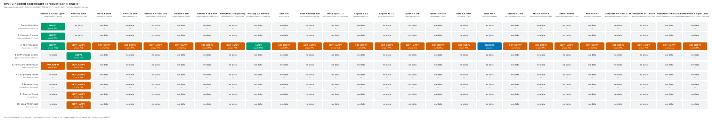
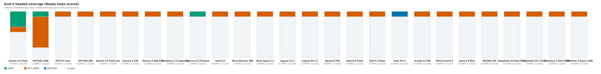
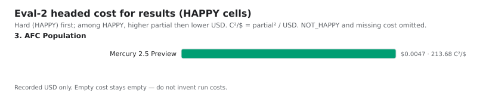
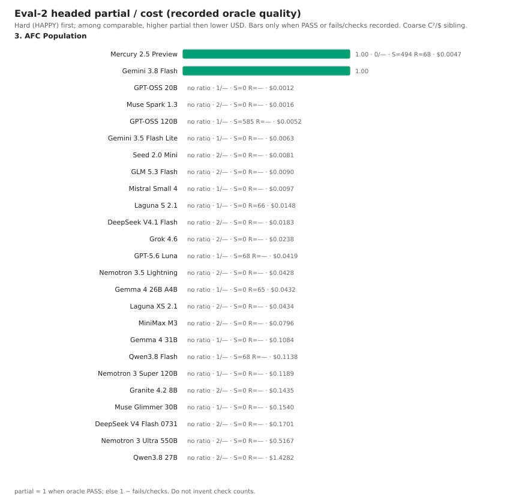

# Eval-2 headed benchmarks

**Different benchmark** from the 17-task string pack
([`docs/eval/benchmarks.md`](../benchmarks.md) / Pareto): same hard /
partial / cost philosophy, but headed multi-doc GDPval-style tasks that
are much harder. One filled task still counts.

Eval-2 is the **headed sibling** of that pack. Runs track product
success and **Intelligence-per-Dollar**. **Value (C²/$)** = oracle
`partial_score` squared ÷ recorded USD on a HAPPY cell (higher is
better), when both were measured.

String-pack snapshot: [`docs/eval/benchmarks.md`](../benchmarks.md)
(`hard_pass_rate`, C²/$, `pareto-*.svg`). How to run the headed helper:
[`README.md`](README.md). Living autopsy:
[`headed-failure-autopsy.md`](headed-failure-autopsy.md).

Keep the stores separate. Do **not** fold headed stamps into
`scripts/prompt_optimization/benchmark_results.json` or overwrite
`docs/eval/pareto-*.svg`.

| Axis | String pack | Eval-2 (sibling) |
|---|---|---|
| Tasks | 17 short Writer/Calc/Draw worlds | 9 Ready / Headed-ready siblings (slot 7 PARKED) |
| Hard | `hard_pass_rate` (substring + result + process oracles) | **Product HAPPY** (oracle PASS when that is the hard gate — AFC after the smoother) |
| Partial | correctness / quality | **Oracle partial** (`1 − failures/checks`; AFC S/R, husks) |
| Cost | C²/$ = metric² ÷ avg $/task | C²/$ = `partial_score`² ÷ USD among HAPPY |
| Gate | Catalog sweep on OpenRouter | **`google/gemini-3.8-flash`** until HAPPY (gpt-oss is not the product gate) |
| Charts | `pareto-fronts.svg` / `pareto-distance.svg` | [`eval2-heatmap.svg`](eval2-heatmap.svg), [`eval2-coverage.svg`](eval2-coverage.svg), [`eval2-cost.svg`](eval2-cost.svg), [`eval2-partial.svg`](eval2-partial.svg) |

Ranked by **hard → partial → cost**. **Hard** = product HAPPY (the
deliverable did the job). **Partial** = oracle quality among recorded
checks. **C²/$** is secondary, among HAPPY cells that recorded both
partial and USD.

**HAPPY** can sit on a soft oracle FAIL (false-red or a secondary
cite). **NOT_HAPPY** + oracle FAIL is usually an empty or wrong-facts
deliverable. **—** means no in-repo headed stamp; do not invent a
score. Every prior catalog column has an AFC stamp only (including Muse
Glimmer 30B, Muse Spark 1.3, both Lagunas, both Qwen3.8s, GLM 5.3 Flash,
Solar Pro 4, Granite 4.2 8B, Mistral Small 4, Seed 2.0 Mini,
MiniMax M3, DeepSeek V4 Flash 0731, and DeepSeek V4.1 Flash).
Paid Nemotron 3 Ultra 550B and Nemotron 3 Super 120B now have first-class AFC stamps (`20260912-1506-nemotron-3-ultra-550b`, `20260912-1513-nemotron-3-super-120b`); both NOT_HAPPY / oracle FAIL.
AFC catalog FIFO is complete (oss-120b through V4.1 Flash); paid Ultra/Super stamps folded in after. Solar
is **BLOCKED** infra (Send never ran) — not NOT_HAPPY. The
catalog-wide headed
sweep has **not** happened.

## Snapshot ranking (2026-09-12)

Seeded from the autopsy, sibling notes, and Scrolly AFC catalog
stamps (`20260912-0142-gpt-oss-120b`, `20260912-0150-gpt-5.6-luna`,
`20260912-0202-gpt-oss-20b-nitro`,
`20260912-0216-gemini-3.5-flash-lite`, `20260912-0224-gemma-4-31b-it`,
`20260912-0240-gemma-4-26b-a4b-it`,
`20260912-0310-nemotron-3.5-lightning`,
`20260912-0330-mercury-2.5-preview`, `20260912-0342-grok-4.6`,
`20260912-0353-muse-glimmer-30b`,
`20260912-0409-muse-spark-1.3-contributor`,
`20260912-0419-laguna-s-2.1`,
`20260912-0429-laguna-xs-2.1`,
`20260912-0443-qwen3.8-27b`,
`20260912-0502-qwen3.8-flash`,
`20260912-0515-glm-5.3-flash`,
`20260912-0522-solar-pro4`,
`20260912-0546-granite-4.2-8b`,
`20260912-0603-mistral-small-2603`,
`20260912-0610-seed-2.0-mini`,
`20260912-0617-minimax-m3`,
`20260912-0621-deepseek-v4-flash-0731`,
`20260912-0630-deepseek-v4.1-flash`, box-local). AFC catalog FIFO
is complete. Run dirs are typically
untracked —
`run_artifacts_committed` is false for every cell. No OpenRouter
eval-2 CI job. Mercury 2.5 Preview is the first HAPPY cell with
recorded USD.

Artifacts: [`eval2_benchmark_results.json`](eval2_benchmark_results.json)
(+ [schema](eval2_benchmark_results.schema.json)).

| # | Task | Gemini 3.8 Flash | GPT-OSS 120B | GPT-5.6 Luna | GPT-OSS 20B | Gemini 3.5 Flash Lite | Gemma 4 31B | Gemma 4 26B A4B | Nemotron 3.5 Lightning | Mercury 2.5 Preview | Grok 4.6 | Muse Glimmer 30B | Muse Spark 1.3 | Laguna S 2.1 | Laguna XS 2.1 | Qwen3.8 27B | Qwen3.8 Flash | GLM 5.3 Flash | Solar Pro 4 | Granite 4.2 8B | Mistral Small 4 | Seed 2.0 Mini | MiniMax M3 | DeepSeek V4 Flash 0731 | DeepSeek V4.1 Flash | Nemotron 3 Ultra 550B | Nemotron 3 Super 120B |
| --- | --- | --- | --- | --- | --- | --- | --- | --- | --- | --- | --- | --- | --- | --- | --- | --- | --- | --- | --- | --- | --- | --- | --- | --- | --- | --- | --- |
| 1 | Tenant Retention | HAPPY / oracle FAIL | — | — | — | — | — | — | — | — | — | — | — | — | — | — | — | — | — | — | — | — | — | — | — | — | — |
| 2 | Cadaver Proposal | HAPPY / oracle FAIL | — | — | — | — | — | — | — | — | — | — | — | — | — | — | — | — | — | — | — | — | — | — | — | — | — |
| 3 | AFC Population | HAPPY / oracle PASS | NOT_HAPPY / oracle FAIL | NOT_HAPPY / oracle FAIL | NOT_HAPPY / oracle FAIL | NOT_HAPPY / oracle FAIL | NOT_HAPPY / oracle FAIL | NOT_HAPPY / oracle FAIL | NOT_HAPPY / oracle FAIL | HAPPY / oracle PASS | NOT_HAPPY / oracle FAIL | NOT_HAPPY / oracle FAIL | NOT_HAPPY / oracle FAIL | NOT_HAPPY / oracle FAIL | NOT_HAPPY / oracle FAIL | NOT_HAPPY / oracle FAIL | NOT_HAPPY / oracle FAIL | NOT_HAPPY / oracle FAIL | BLOCKED / unscored | NOT_HAPPY / oracle FAIL | NOT_HAPPY / oracle FAIL | NOT_HAPPY / oracle FAIL | NOT_HAPPY / oracle FAIL | NOT_HAPPY / oracle FAIL | NOT_HAPPY / oracle FAIL | NOT_HAPPY / oracle FAIL | NOT_HAPPY / oracle FAIL |
| 4 | GMP Change Control | — | HAPPY / oracle FAIL | — | — | — | — | — | — | — | — | — | — | — | — | — | — | — | — | — | — | — | — | — | — | — | — |
| 5 | Floorstand Writer→Calc | NOT_HAPPY / oracle FAIL | NOT_HAPPY / oracle FAIL | — | — | — | — | — | — | — | — | — | — | — | — | — | — | — | — | — | — | — | — | — | — | — | — |
| 6 | Calc-primary model | — | NOT_HAPPY / oracle FAIL | — | — | — | — | — | — | — | — | — | — | — | — | — | — | — | — | — | — | — | — | — | — | — | — |
| 8 | Draw-primary | — | NOT_HAPPY / oracle FAIL | — | — | — | — | — | — | — | — | — | — | — | — | — | — | — | — | — | — | — | — | — | — | — | — |
| 9 | Reverse Tenant | — | NOT_HAPPY / oracle FAIL | — | — | — | — | — | — | — | — | — | — | — | — | — | — | — | — | — | — | — | — | — | — | — | — |
| 10 | Long Writer pack | — | NOT_HAPPY / oracle FAIL | — | — | — | — | — | — | — | — | — | — | — | — | — | — | — | — | — | — | — | — | — | — | — | — |







| # | Task | Model | Cost (USD) | Tokens | Wall (s) | C²/$ |
| --- | --- | --- | --- | --- | --- | --- |
| 3 | AFC Population | Mercury 2.5 Preview | 0.0047 | 118650 | 479 | 213.68 |



## Key insights

1. **Hard (HAPPY):** Gemini 3.8 Flash is HAPPY on Tenant, Cadaver, and
   AFC. gpt-oss-120b is HAPPY only on GMP-0225. Mercury 2.5 Preview
   (`20260912-0330`) is the first non-gate catalog **HAPPY / oracle
   PASS** (S=494 ≥ R=68 on a 1518-row near-full Sample). Earlier
   catalog AFC cells (`20260912-0142` 120b through `20260912-0342`
   Grok, plus Glimmer, Spark, both Lagunas, both Qwen3.8s, GLM 5.3
   Flash, Granite 4.2 8B, Mistral Small 4, Seed 2.0 Mini, MiniMax M3,
   DeepSeek V4 Flash 0731, and DeepSeek V4.1 Flash, plus paid Ultra 550B and Super 120B) are NOT HAPPY
   except Mercury. Solar Pro
   4 is **BLOCKED** infra (`SendButton` / `message_store` sqlite
   crash; Send never ran) — not a model fail. Most
   miss R. Gemma 4 26B A4B produced R=65 then failed S=0 < R. Laguna S
   produced parseable R=66 but the Sample sheet is missing
   (`failure_count=1`; truncated mid tool loop). Laguna XS is
   `failure_count=2` (SSC tab named `Sample_Size_Calculation`; Sample
   empty). Nemotron, Qwen3.8 27B, GLM 5.3 Flash, MiniMax M3, and
   DeepSeek V4.1 Flash are `failure_count=2` (missing Sample+SSC).
   V4.1 Flash API-timed-out mid `tool_loop` round 5 on
   `read_cell_range` (`NetworkError`; n=5) — NOT_HAPPY, not BLOCKED,
   because Send ran. MiniMax is Ready with an
   Analysis sheet (`A1=#NAME?`, `A2=8`) but no Sample/SSC. GLM hung at `tool_loop`
   round 0 (`finish_reason=length`; no tools; n=1). Qwen3.8 27B stayed on Population
   with `=PY` (~50 tool rounds; PreContract 63). Qwen3.8 Flash is a
   Luna-like incomplete Sample (68 rows, S=68) with SSC
   Err:508/509/#VALUE! and Scratch Err:513. Grok, Spark, Granite
   4.2 8B, and DeepSeek V4 Flash 0731 are also `failure_count=2`
   (SSC present, Sample empty, R missing). DeepSeek Sample errored
   `deal.PreContractError expected__deal_wire_dict_ok` (PreContract
   18); SSC blank; n=51. Granite hung `tool_loop` at round 46 on
   `read_cell_range` (n=48; all `finish_reason=tool_calls`). Glimmer
   and Mistral Small 4 are the same R hole as Luna/20b/Flash Lite on
   an 81-row Sample with S=0 (Mistral husks 0/648, same as Flash
   Lite; Glimmer husks 0/729). Seed 2.0 Mini is the first catalog
   husk-dominated Sample (`1/1`; `failure_count=2` with R missing);
   A2 is malformed `=PY("""` and SSC is Err:501 with a visual ~65
   (oracle R=None). Glimmer SSC
   B9 looked like 65 but oracle R=None. Luna’s Sample is a better
   incomplete shape (81 rows, S=68) than 120b’s 1516-row dump.
   Floorstand is NOT HAPPY on both Gemini 3.8 and 120b. Overnight
   slots 6/8/9/10 (gpt-oss only) are all NOT HAPPY.
2. **Partial:** AFC Gemini 3.8 and Mercury are oracle PASS
   (`partial_score` = 1). Other catalog AFC cells recorded
   `failure_count` (1, or 2 on Nemotron/Grok/Spark/Laguna XS/Qwen3.8 27B/GLM 5.3 Flash/Granite 4.2 8B/Seed 2.0 Mini/MiniMax M3/DeepSeek V4 Flash 0731/DeepSeek V4.1 Flash) plus S/husks but no
   `oracle_check_count`, so no FAIL ratio. Tenant / Cadaver / GMP
   HAPPY cells are still oracle FAIL without a recorded check count.
   Do not invent one from autopsy prose.
3. **C²/$:** Mercury 2.5 Preview is the first HAPPY cell with
   recorded `total_cost_usd` (~$0.00468 OpenRouter). The cost chart
   now has one bar. Value is `partial_score`² ÷ that USD among HAPPY
   (≈213.68). Other catalog USD stays on NOT_HAPPY cells.
4. **Coverage:** every prior catalog column has AFC only. Ultra 550B
   and Super 120B now have first-class AFC cells (stamps
   `20260912-1506-nemotron-3-ultra-550b` /
   `20260912-1513-nemotron-3-super-120b`; both NOT_HAPPY / oracle FAIL). Gemini 3.8
   has no stamp yet for GMP, Calc-primary, Draw-primary, Reverse
   Tenant, or Long Writer.
   gpt-oss-120b has no stamp for Tenant or Cadaver.

### Cell notes (only scored pairs)

| Task | Model | Stamp | Soft note |
|------|-------|-------|-----------|
| Tenant Retention | Gemini 3.8 Flash | `20260908-0121-gemini-3.8-flash-r200` | Oracle false-red (titles in `text:h`, table cells, length); later softened. |
| Cadaver Proposal | Gemini 3.8 Flash | `20260908-2246-gemini-3.8-flash-r200` | Oracle false-red (aliases, Figure/`draw:frame`, length). |
| AFC Population | Gemini 3.8 Flash | `20260908-0030-retry2` | Oracle PASS after smoother (S=65 R=2). Autopsy abbreviates the stamp with `…`. |
| AFC Population | GPT-OSS 120B | `20260912-0142-gpt-oss-120b` | First catalog cell. Sample+SSC nonempty but wrong shape (1516 rows); R missing; S=585; husks 0/15159; Ready then kept iterating. Box-local `docs/eval/eval-2/afc-sample-83d10b06/runs/20260912-0142-gpt-oss-120b/`. |
| AFC Population | GPT-5.6 Luna | `20260912-0150-gpt-5.6-luna` | Second catalog cell. Sample+SSC present but incomplete (81 rows; S=68; husks 0/810); same R hole as 120b. OpenRouter usage ~$0.0419 (model_configs alt ~$0.1252 not stored). Box-local `docs/eval/eval-2/afc-sample-83d10b06/runs/20260912-0150-gpt-5.6-luna/`. |
| AFC Population | GPT-OSS 20B | `20260912-0202-gpt-oss-20b-nitro` | Third catalog cell. Ran as `:nitro` (resolved to bare 20b). Sample/SSC present but incomplete (80 rows; S=0; husks 0/800); same R hole, weaker than Luna. OpenRouter usage ~$0.00122 (model_configs alt ~$0.00049 not stored). Box-local `docs/eval/eval-2/afc-sample-83d10b06/runs/20260912-0202-gpt-oss-20b-nitro/`. |
| AFC Population | Gemini 3.5 Flash Lite | `20260912-0216-gemini-3.5-flash-lite` | Fourth catalog cell. Attempt1 aborted (nitro contamination); attempt2 clean history. Sample/SSC present (81 rows; S=0; husks 0/648). Shot SSC label truncated “Required Sar”=73; oracle R=None. OpenRouter usage ~$0.00629 (model_configs alt ~$0.00821 not stored). Box-local `docs/eval/eval-2/afc-sample-83d10b06/runs/20260912-0216-gemini-3.5-flash-lite/`. |
| AFC Population | Gemma 4 31B | `20260912-0224-gemma-4-31b-it` | Fifth catalog cell. Sample+SSC present (81 rows; S=0; husks 81/810). SSC R is Err:508/#NAME?; oracle R=None. OpenRouter usage ~$0.10841 (model_configs alt ~$0.01404 not stored). Box-local `docs/eval/eval-2/afc-sample-83d10b06/runs/20260912-0224-gemma-4-31b-it/`. |
| AFC Population | Gemma 4 26B A4B | `20260912-0240-gemma-4-26b-a4b-it` | Sixth catalog cell. First catalog R=65 besides the Gemini gate; Sample undersized (10 rows, S=0 < R). Attempt1 contaminated; attempt2 wipe. OpenRouter usage ~$0.04316 (model_configs alt ~$0.05011 not stored). Box-local `docs/eval/eval-2/afc-sample-83d10b06/runs/20260912-0240-gemma-4-26b-a4b-it/`. |
| AFC Population | Nemotron 3.5 Lightning | `20260912-0310-nemotron-3.5-lightning` | Seventh catalog cell. Population only; missing Sample+SSC (`failure_count=2`); S=0 R=None; husks 0/0; Err:507 in J/K; Save dialog flicker. Tokens are second-send (all-from-first higher, not stored). OpenRouter second-send ~$0.04282 (model_configs alt ~$0.06145 not stored). Box-local `docs/eval/eval-2/afc-sample-83d10b06/runs/20260912-0310-nemotron-3.5-lightning/`. |
| AFC Population | Mercury 2.5 Preview | `20260912-0330-mercury-2.5-preview` | Eighth catalog cell. First non-gate HAPPY / oracle PASS. Near-full Sample (1518 rows) but S=494 ≥ R=68; husks 2/16680. Attempt1 contaminated; attempt2 wipe. OpenRouter usage ~$0.00468 (model_configs alt ~$0.03144 not stored). First HAPPY USD — lights the cost chart. Box-local `docs/eval/eval-2/afc-sample-83d10b06/runs/20260912-0330-mercury-2.5-preview/`. |
| AFC Population | Grok 4.6 | `20260912-0342-grok-4.6` | Ninth catalog cell. SSC present; Sample empty (`failure_count=2`: no data rows + R missing); S=0 R=None; husks 0/0. OpenRouter usage ~$0.02375 (model_configs alt ~$0.05831 not stored). Box-local `docs/eval/eval-2/afc-sample-83d10b06/runs/20260912-0342-grok-4.6/`. |
| AFC Population | Muse Glimmer 30B | `20260912-0353-muse-glimmer-30b` | Tenth catalog cell. Sample+SSC present (81 rows; S=0; husks 0/729); same R hole. SSC B9 visually 65; oracle R=None. Hit max 50 tool rounds; recorded wall ~155s (observer ~16 min). tip `e0bb6321`. OpenRouter usage ~$0.15404 (model_configs alt ~$0.66230 not stored). Box-local `docs/eval/eval-2/afc-sample-83d10b06/runs/20260912-0353-muse-glimmer-30b/`. |
| AFC Population | Muse Spark 1.3 | `20260912-0409-muse-spark-1.3-contributor` | Eleventh catalog cell. SSC present; Sample empty (`failure_count=2`: no data rows + R missing); S=0 R=None; husks 0/0. Same empty-Sample shape as Grok. tip `6c6017b7`. UNO/assert/PreContract 0. OpenRouter usage ~$0.00157 (model_configs alt ~$0.00247 not stored). Box-local `docs/eval/eval-2/afc-sample-83d10b06/runs/20260912-0409-muse-spark-1.3-contributor/`. |
| AFC Population | Laguna S 2.1 | `20260912-0419-laguna-s-2.1` | Twelfth catalog cell. SSC present with parseable R=66; Sample sheet missing (`failure_count=1`); S=0 R=66; husks 0/0. `finish_reason=length` — truncated mid tool loop. tip `6c6017b7`. UNO/assert/PreContract 0. OpenRouter usage ~$0.01480 (model_configs alt ~$0.02142 not stored). Box-local `docs/eval/eval-2/afc-sample-83d10b06/runs/20260912-0419-laguna-s-2.1/`. |
| AFC Population | Laguna XS 2.1 | `20260912-0429-laguna-xs-2.1` | Thirteenth catalog cell. SSC tab named `Sample_Size_Calculation` (oracle missing SSC); Sample empty (`failure_count=2`); S=0 R=None; husks 0/0. Raw `tool_call` text in the reply. Recorded wall ~85s (observer ~3m12s). tip `6c6017b7`. UNO/assert/PreContract 0. OpenRouter usage ~$0.04341 (model_configs alt ~$0.07804 not stored). Box-local `docs/eval/eval-2/afc-sample-83d10b06/runs/20260912-0429-laguna-xs-2.1/`. |
| AFC Population | Qwen3.8 27B | `20260912-0443-qwen3.8-27b` | Fourteenth catalog cell. Population only; missing Sample+SSC (`failure_count=2`); S=0 R=None; husks 0/0. Stayed on Population with `=PY`; ~50 tool rounds all `finish_reason=tool_calls`. Tokens n=51. PreContract 63; UNO/assert 0. Recorded wall ~720s (12 min LLM). tip `6c6017b7`. OpenRouter usage ~$1.42823 (model_configs alt ~$1.31711 not stored). Box-local `docs/eval/eval-2/afc-sample-83d10b06/runs/20260912-0443-qwen3.8-27b/`. |
| AFC Population | Qwen3.8 Flash | `20260912-0502-qwen3.8-flash` | Fifteenth catalog cell. Sample+SSC present (68 rows; S=68; husks 0/680); same R hole as Luna. SSC Err:508/509/#VALUE!; Scratch Err:513. Tokens n=51. tip `6c6017b7`. UNO/assert/PreContract 0. Recorded wall ~540s (9 min LLM; observer ~12 min). OpenRouter usage ~$0.11382 (model_configs alt ~$0.35238 not stored). Box-local `docs/eval/eval-2/afc-sample-83d10b06/runs/20260912-0502-qwen3.8-flash/`. |
| AFC Population | GLM 5.3 Flash | `20260912-0515-glm-5.3-flash` | Sixteenth catalog cell. Population only; missing Sample+SSC (`failure_count=2`); S=0 R=None; husks 0/0. Hung `tool_loop` round 0 — `finish_reason=length`; no tools; truncated reasoning dump. Tokens n=1 (`reasoning_tokens=15160` noted, not stored). tip `6c6017b7`. UNO/assert/PreContract 0. Recorded wall ~155s. OpenRouter usage ~$0.00900 (model_configs alt ~$0.00450 not stored). Box-local `docs/eval/eval-2/afc-sample-83d10b06/runs/20260912-0515-glm-5.3-flash/`. |
| AFC Population | Solar Pro 4 | `20260912-0522-solar-pro4` | Seventeenth catalog cell — **BLOCKED** infra, not a model fail. `SendButton` crashed before any LLM call (`sqlite3.OperationalError: no such table: message_store`). Send failed twice. Oracle unscored (missing Sample+SSC only because Send never ran). Tokens 0; cost $0. Headed wait ~1080s. tip `6c6017b7`. Scrolly recreating schema before next trial. Box-local `docs/eval/eval-2/afc-sample-83d10b06/runs/20260912-0522-solar-pro4/`. |
| AFC Population | Granite 4.2 8B | `20260912-0546-granite-4.2-8b` | Eighteenth catalog cell. SSC present; Sample empty (`failure_count=2`: no data rows + R missing); S=0 R=None; husks 0/0. Hung `tool_loop` round 46 on `read_cell_range`; all `finish_reason=tool_calls`. Tokens n=48. tip `71640e30`. UNO/assert/PreContract 0. Recorded wall ~840s (14 min LLM). OpenRouter usage ~$0.14353 (model_configs alt ~$0.24564 not stored). Box-local `docs/eval/eval-2/afc-sample-83d10b06/runs/20260912-0546-granite-4.2-8b/`. |
| AFC Population | Mistral Small 4 | `20260912-0603-mistral-small-2603` | Nineteenth catalog cell. Ready with Sample+SSC (81 rows; S=0; husks 0/648); same R hole as Flash Lite (`failure_count=1`). Tokens n=14. tip `71640e30`. UNO/assert/PreContract 0. Recorded wall ~32s. OpenRouter usage ~$0.00973 (model_configs alt ~$0.02475 not stored). Box-local `docs/eval/eval-2/afc-sample-83d10b06/runs/20260912-0603-mistral-small-2603/`. |
| AFC Population | Seed 2.0 Mini | `20260912-0610-seed-2.0-mini` | Twentieth catalog cell. Sample malformed (`=PY("""` in A2; 1 row; S=0; husks 1/1 — first husk-dominated Sample). SSC Err:501 / visual ~65; oracle R=None (`failure_count=2`). Tokens n=2. tip `71640e30`. UNO/assert/PreContract 0. Recorded wall ~131s. OpenRouter usage ~$0.00814 (model_configs alt matches, not stored). Box-local `docs/eval/eval-2/afc-sample-83d10b06/runs/20260912-0610-seed-2.0-mini/`. |
| AFC Population | MiniMax M3 | `20260912-0617-minimax-m3` | Twenty-first catalog cell. Ready; missing Sample+SSC (`failure_count=2`); S=0 R=None; husks 0/0. Analysis A1=`#NAME?` A2=8. Tokens n=30. tip `71640e30`. UNO/assert/PreContract 0. Recorded wall ~66s. OpenRouter usage ~$0.07965 (model_configs alt ~$0.10003 not stored). Box-local `docs/eval/eval-2/afc-sample-83d10b06/runs/20260912-0617-minimax-m3/`. |
| AFC Population | DeepSeek V4 Flash 0731 | `20260912-0621-deepseek-v4-flash-0731` | Twenty-second catalog cell. Ready; Sample empty + SSC blank (`failure_count=2`: no data rows + R missing); S=0 R=None; husks 0/0. Sample `deal.PreContractError expected__deal_wire_dict_ok`. Tokens n=51. tip `71640e30`. PreContract 18; UNO/assert 0. Recorded wall ~330s. OpenRouter usage ~$0.17007 (model_configs alt ~$0.18897 not stored). Box-local `docs/eval/eval-2/afc-sample-83d10b06/runs/20260912-0621-deepseek-v4-flash-0731/`. |
| AFC Population | DeepSeek V4.1 Flash | `20260912-0630-deepseek-v4.1-flash` | Twenty-third catalog cell — **FIFO tail**. API timed out mid `tool_loop` round 5 on `read_cell_range` (`NetworkError`); model never finished. NOT_HAPPY (Send ran; leftover workbook scored). Missing Sample+SSC (`failure_count=2`); S=0 R=None; husks 0/0. Tokens n=5. tip `71640e30`. UNO/assert/PreContract 0. Recorded wall ~270s. OpenRouter usage ~$0.01832 (model_configs alt ~$0.01043 not stored). CATALOG FIFO COMPLETE. Box-local `docs/eval/eval-2/afc-sample-83d10b06/runs/20260912-0630-deepseek-v4.1-flash/`. |
| AFC Population | Nemotron 3 Ultra 550B | `20260912-1506-nemotron-3-ultra-550b` | Twenty-fourth catalog cell (paid). Population only; missing Sample+SSC (`failure_count=2`); S=0 R=None; husks 0/0. OpenRouter usage ~$0.51665. tip `400d5233`. Artifacts committed. Box-local `docs/eval/eval-2/afc-sample-83d10b06/runs/20260912-1506-nemotron-3-ultra-550b/`.
| AFC Population | Nemotron 3 Super 120B | `20260912-1513-nemotron-3-super-120b` | Twenty-fifth catalog cell (paid). Sample+SSC present; Sample 1516 rows; R missing (`failure_count=1`); S=0 R=None; husks 0/21953. SSC UI rounded ~68. OpenRouter usage ~$0.11893. tip `400d5233`. Catalog stamp is 1513 (not #750 retest 1646). Artifacts committed. Box-local `docs/eval/eval-2/afc-sample-83d10b06/runs/20260912-1513-nemotron-3-super-120b/`.
| Floorstand | Gemini 3.8 Flash | `20260909-1748-gemini-3.8-flash-private-patch` | Polarity HIT; still empty + stall. Private patches, not PR’d. |
| GMP Change Control | GPT-OSS 120B | `20260909-0225-gpt-oss-120b` | Cite-only oracle fail. Prior `0103` was NOT HAPPY (dump polarity). |
| Floorstand | GPT-OSS 120B | `20260909-0323-gpt-oss-120b` | Extract/JSON polarity MISS; empty + LO crash. Private `1733` still MISS. |
| Calc-primary | GPT-OSS 120B | `20260909-0400-gpt-oss-120b` | CSV-row dump + wrong ARPU factor + phantom `headcount` sheet. |
| Draw-primary | GPT-OSS 120B | `20260909-0411-gpt-oss-120b` | Garbled layout; missing Clearbend / failure / triage. |
| Reverse Tenant | GPT-OSS 120B | `20260909-0414-gpt-oss-120b` | Talk-not-write; 0 cells + PreContractError. |
| Long Writer pack | GPT-OSS 120B | `20260909-0419-gpt-oss-120b` | Invented $12.5M / wrong dates; 0 comments. |

## Scoring approach

Hard is the product bar: **HAPPY first**. A cheaper or higher-partial
NOT_HAPPY run does not outrank an expensive HAPPY one. When the headed
bar *is* the oracle (AFC after the smoother), **oracle PASS** is the
hard gate for that task.

Partial is oracle quality in [0, 1], computed only when honest:

- `1` when the oracle passed (`oracle` is PASS, or `oracle_passed` is
  true).
- Otherwise `1 − oracle_failure_count / oracle_check_count` when
  **both** counts were recorded from that stamp's `--score` JSON.
- Omit when FAIL and `oracle_check_count` is unknown. Do **not**
  invent a denominator from the failure strings or a guessed check
  count.

AFC (`eval_2_ods_oracle`) and the Writer/Calc/Draw oracles are
fail-closed (`passed` iff `failures` is empty) but still expose S/R,
husks, and the `failures` list. Those label a row; they are not a
fake 0–1 axis by themselves.

**C²/$** among successes: `partial_score`² ÷ `total_cost_usd` when
the cell is HAPPY and both values were recorded (same shape as the
string-pack Value). Omit when cost is unknown or zero, or when
partial is unknown. Do **not** invent run costs from tokens, list
prices, or wall time.

Optional result fields (`oracle_passed`, `oracle_failure_count`,
`oracle_check_count`, `oracle_failures`, `afc_s_flags`,
`afc_r_required`, `husk_cells`, `scored_cells`, `partial_score`,
`total_tokens`, `input_tokens`, `output_tokens`, `total_cost_usd`,
`wall_time_s`, `intelligence_per_dollar`) stay empty unless a stamp
recorded them. The 2026-09-12 seed still has derived PASS →
`partial_score` = 1 on AFC Gemini. Catalog AFC stamps
(`20260912-0142-gpt-oss-120b`, `20260912-0150-gpt-5.6-luna`,
`20260912-0202-gpt-oss-20b-nitro`,
`20260912-0216-gemini-3.5-flash-lite`, `20260912-0224-gemma-4-31b-it`,
`20260912-0240-gemma-4-26b-a4b-it`,
`20260912-0310-nemotron-3.5-lightning`,
`20260912-0330-mercury-2.5-preview`, `20260912-0342-grok-4.6`,
`20260912-0353-muse-glimmer-30b`,
`20260912-0409-muse-spark-1.3-contributor`,
`20260912-0419-laguna-s-2.1`,
`20260912-0429-laguna-xs-2.1`,
`20260912-0443-qwen3.8-27b`,
`20260912-0502-qwen3.8-flash`,
`20260912-0515-glm-5.3-flash`,
`20260912-0546-granite-4.2-8b`,
`20260912-0603-mistral-small-2603`,
`20260912-0610-seed-2.0-mini`,
`20260912-0617-minimax-m3`,
`20260912-0621-deepseek-v4-flash-0731`,
`20260912-0630-deepseek-v4.1-flash`) recorded tokens, wall,
USD, and S/husks. `20260912-0522-solar-pro4` is **BLOCKED** infra
(tokens/cost 0; oracle omitted). FAIL cells have `failure_count` 1 (or 2 on
Nemotron/Grok/Spark/Laguna XS/Qwen3.8 27B/GLM 5.3 Flash/Granite 4.2 8B/Seed 2.0 Mini/MiniMax M3/DeepSeek V4 Flash 0731/DeepSeek V4.1 Flash) and no `oracle_check_count` / `partial_score`.
Laguna S stored parseable R=66 with a missing Sample sheet. Laguna XS
renamed the SSC tab so R is missing. Qwen3.8 27B matches Nemotron’s
missing Sample+SSC shape at far higher USD. Qwen3.8 Flash is the
Luna-like S=68 R-missing Sample on 68 rows. GLM 5.3 Flash hung at
round 0 with no tools and the same missing Sample+SSC shape.
Granite 4.2 8B matches Grok/Spark’s empty-Sample + SSC-present R
hole, hung at round 46 on `read_cell_range`.
Mistral Small 4 matches Flash Lite’s 81-row S=0 husks-0/648 R hole
(`failure_count=1`).
Seed 2.0 Mini is the first husk-dominated Sample (`1/1`) plus R
missing (`failure_count=2`); visual SSC ~65 is not stored as R.
MiniMax M3 matches Nemotron/GLM’s missing Sample+SSC with a Ready
Analysis sheet (`#NAME?` / 8).
DeepSeek V4 Flash 0731 matches Grok/Spark’s empty-Sample + blank-SSC
R hole with PreContract 18 on Sample.
DeepSeek V4.1 Flash matches Nemotron/GLM’s missing Sample+SSC after
an API timeout mid `read_cell_range` (NOT_HAPPY, not BLOCKED).
Mercury is PASS (`failure_count=0`) so `partial_score` = 1 and C²/$
is derived from the recorded USD.

## How to refresh

1. After a headed `--launch` / `--score`, add or replace **one** object
   in [`eval2_benchmark_results.json`](eval2_benchmark_results.json)
   (`task_id` × `model`). Leave unknown pairs **out** of `results`.
2. Fields: `product_bar` (`HAPPY` \| `NOT_HAPPY` \| `BLOCKED`), `oracle`
   (`PASS` \| `FAIL`; omit/null when BLOCKED / unscored), optional `oracle_note` / `stamp` / `source` /
   `patches`. Optional hard/partial/cost extras (omit when unknown):
   `oracle_passed`, `oracle_failure_count`, `oracle_check_count`,
   `oracle_failures`, `afc_s_flags` / `afc_r_required`, `husk_cells` /
   `scored_cells`, `partial_score` (`1` on PASS; else
   `1 − failures/checks` when both counts were recorded),
   `total_tokens` / `input_tokens` / `output_tokens`,
   `total_cost_usd`, `wall_time_s`, `intelligence_per_dollar`
   (`partial_score`² ÷ USD when HAPPY and both recorded). Schema:
   [`eval2_benchmark_results.schema.json`](eval2_benchmark_results.schema.json).
3. `task_id` must match `scripts/eval_2_headed.py --task` (`afc`,
   `tenant-retention`, …). Slot 7 stays omitted.
4. Redraw charts (no API key):

   ```bash
   .venv/bin/python scripts/plot_eval2_leaderboard.py
   .venv/bin/python scripts/plot_eval2_leaderboard.py --print-matrix
   ```

5. Paste the printed matrix into the snapshot table above if the
   cells changed. `--print-matrix` also prints the HAPPY cost table
   and the hard → partial → cost ranking. Update `updated` in the
   JSON. Do **not** copy rows into the string-pack leaderboard. Do
   **not** invent `total_cost_usd`, `oracle_check_count`, or
   `partial_score`.

`--check` validates the JSON only. The plot script refuses
`benchmark_results.json` so a wrong `--in` cannot overwrite Pareto
charts.
