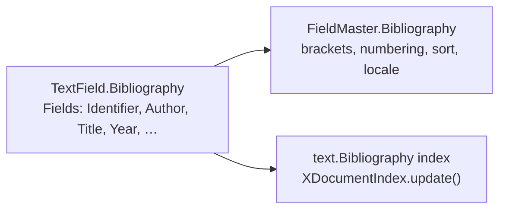

# Bibliography via the indexes domain

**Status:** v1 implemented (indexes overload). Design locked with Keith (2026-09).  
**Audience:** Implementers of Writer specialized tools.  
**Gateway:** `delegate_to_specialized_writer_toolset` with `domain=indexes` only. Do **not** productize `domain=bibliography`.

This page records **decisions**, **in-repo ground**, a **v1 UNO sketch**, a **v2 Zotero research** note (first-party local API / BBT-style, not Zotero’s LibreOffice plugin), and **open questions**. Cite insertion stays one native Writer object for both versions.

---

## Locked decisions

1. **v1 is LibreOffice native UNO, not Zotero.** Citations and the reference list are Writer objects the user can already create from Insert → Table of Contents and Index / Bibliography Entry. No reference-manager process is required for v1.
2. **Fold bibliography into the existing `indexes` specialized domain.** Fewer domains. Optional parameters that a model can ignore. Do **not** add `domain=bibliography` to the gateway enum or prompt list.
3. **`mock_domains` `Bibliography*` tools and `ToolWriterBibliographyBase` are not design intent.** They sat in a commented ~30-domain delegation stress test (`specialized_base.py` mock bases + `mock_domains.py`). Do not uncomment them as a product surface. Real work overloads `indexes_*`.
4. **Zotero is roadmap v2: our integration, not their plugin.** Talk to a running Zotero desktop via the local HTTP API (and BBT-style citekeys when present). Do not embed, wrap, or require [zotero-libreoffice-integration](https://github.com/zotero/zotero-libreoffice-integration).
5. **One cite object in the document.** Zotero (v2) feeds `com.sun.star.text.textfield.Bibliography` `Fields`. No parallel cite path (no Zotero ReferenceMarks / Bookmarks / fieldmarks beside native bib fields).

---

## Non-goals (do not confuse with this work)

These use the word “bibliography” or “citation” and are **out of scope** here:

| Nearby work | Why it is not this feature |
|-------------|----------------------------|
| Eval **Writer: Bibliography Fix** — “Locate all brackets `[1]`, `[2]` and ensure they are superscripted.” ([`tests/eval_runner.py`](../../tests/eval_runner.py), [eval-dev-plan.md](../eval/eval-dev-plan.md), [eval/ideas.md](../eval/ideas.md)) | Pattern-match + character formatting on literal bracket text. No UNO bibliography fields, no index. |
| Hermes **`research/grounded-citations`** ([hermes-agent-patterns.md](../archive/hermes-agent-patterns.md)) | Prompt craft: do not invent `[n]` or URLs; mark model-knowledge `[unverified]`; append a mechanical Sources list. Procedure only — not a UNO module and not `scripts/sources.py`. |
| Zotero’s **Word / LibreOffice / Google Docs plugins** | Their LO plugin is a Java UNO extension plus a local wire protocol. It stores CSL-rendered citations as **ReferenceMarks** (primary) or **Bookmarks**, not `TextField.Bibliography`. We do not ship or drive that plugin. |
| LibreOffice’s default **Bibliography** Base datasource (also listed by mail-merge `mail_merge_list_sources`) | A shared `.odb` address-book-style database for the Insert → Bibliographic Entry “From bibliography database” radio. Useful as a later import source; it is not the in-document cite object and not a WriterAgent domain. |

---

## In-repo ground

### What already ships

[`plugin/writer/specialized/indexes.py`](../../plugin/writer/specialized/indexes.py) is already the bibliography *table* path:

| Tool | Today | Bibliography-relevant gap |
|------|--------|---------------------------|
| `indexes_create` | `kind` enum includes `"bibliography"` → `doc.createInstance("com.sun.star.text.Bibliography")`, insert at `target`, `index.update()`. | No FieldMaster settings (brackets, numbering, sort). |
| `indexes_list` | Enumerates `doc.getDocumentIndexes()`. Prefers `XDocumentIndex.getServiceName()` so a bib table is `type=bibliography` (impl name is `SwXDocumentIndex`, same as alphabetical). Keeps `SwX*` remaps as fallback. | — |
| `indexes_update_all` | `idx.update()` on every document index, including a bibliography table if one exists. | Enough for “refresh the list after cites change.” |
| `indexes_add_mark` | `kind` includes **`bibliography`**. Creates `textfield.Bibliography` and sets `Fields` (typed `[]PropertyValue` via `uno.invoke`). Identifier / Author / Title / Year / Pages / `BibiliographicType`. | Not an index mark — name stretch documented on the tool. |
| `indexes_list_cites` | Walks `getTextFields()`, keeps bibliography text fields, returns identifier + key Fields + location. | — |

Module docstring already says “TOC, bibliography.” `ToolWriterIndexBase.specialized_domain` is `"indexes"` ([`specialized_base.py`](../../plugin/writer/specialized_base.py)). The gateway prompt lists `indexes`, not `bibliography`.

[`plugin/writer/specialized/fields.py`](../../plugin/writer/specialized/fields.py) `fields_insert` can instantiate `com.sun.star.text.textfield.Bibliography` if the model passes `field="Bibliography"`, but it only `setPropertyValue`s scalar properties. Cite payload is the **`Fields` sequence** (`PropertyValue` name/value pairs), which that loop will not populate usefully. `fields_list`’s `KNOWN_PROPERTIES` tuple also omits `Fields`. Do not treat the fields domain as the product cite API; keep cite insert/list on the indexes overload so one domain owns the workflow.

### What must not be productized

[`plugin/writer/specialized/mock_domains.py`](../../plugin/writer/specialized/mock_domains.py) (commented) defines `bibliography_insert_citation`, `bibliography_list_citations`, `bibliography_generate` on `ToolWriterBibliographyBase` (`specialized_domain = "bibliography"`). Same file header: mocks for “testing delegation across 11 new Writer domains.” Combined with the other commented bases in `specialized_base.py` (sections, bibliography, watermark, autotext, toc_enhancement, document_automation, security, document_management, collaboration, customization) this was a **~30-domain stress test** (shipped Writer domains plus mocked ones), not a plan to ship `domain=bibliography`.

Status table in [specialized-toolsets.md](specialized-toolsets.md) previously said “No module.” That row now points here: **planned via indexes overload.**

---

## v1 — native UNO (sketch)

### Objects

Three UNO pieces. v1 uses all three; v2 only writes the first.



1. **Cite (in-flow):** `com.sun.star.text.textfield.Bibliography` (IDL also written `TextField.Bibliography`). A `DependentTextField`. Payload is `Fields`: a sequence of `beans.PropertyValue`. Names are the `BibliographyDataField` identifiers (`Identifier`, `Author`, `Title`, `Year`, `ISBN`, `URL`, `Pages`, …). `BIBILIOGRAPHIC_TYPE` (IDL spelling — one L missing) holds a `BibliographyDataType` constant (book, article, …). `Identifier` is the short key shown when the field master is not in numbered mode.

2. **Document-level settings (park fat here):** `com.sun.star.text.fieldmaster.Bibliography`, reached from `doc.getTextFieldMasters()` and attached with `XDependentTextField.attachTextFieldMaster`. Properties: `IsNumberEntries`, `IsSortByPosition`, `BracketBefore`, `BracketAfter`, `SortKeys`, `Locale`, `SortAlgorithm`. Put numbering / brackets / sort **on the master**, not on every cite tool call and not on `indexes_create`’s required schema. Optional kwargs on an update-table tool can write the master when the model supplies them.

3. **Reference list:** `com.sun.star.text.Bibliography` (the **index**, not the field). Same `BaseIndex` / `XDocumentIndex` as TOC. Create is already `indexes_create kind=bibliography`. After cites change, call `update()` (or `indexes_update_all`).

Implementation classes in Writer (`sw`): field → `SwAuthorityField`, master → `SwAuthorityFieldType`. Source walk-through: [OOo bibliographic component](https://wiki.openoffice.org/wiki/Bibliographic/Developer_Page/Current_Implementation_of_the_Bibliographic_Component). IDL: [textfield.Bibliography](https://api.libreoffice.org/docs/idl/ref/servicecom_1_1sun_1_1star_1_1text_1_1textfield_1_1Bibliography.html), [text.Bibliography](https://api.libreoffice.org/docs/idl/ref/servicecom_1_1sun_1_1star_1_1text_1_1Bibliography.html), [BibliographyDataField](https://api.libreoffice.org/docs/idl/ref/BibliographyDataField_8idl.html), [fieldmaster.Bibliography](https://www.openoffice.org/api/docs/common/ref/com/sun/star/text/fieldmaster/Bibliography.html).

**Probe, do not guess** `Fields` name spelling and `getImplementationName()` for bib indexes. Use `plugin/testing_runner.py` with a live Writer doc (`@native_test`, `ctx`) — see [`tests/chatbot/test_hamburger_menu_uno.py`](../../tests/chatbot/test_hamburger_menu_uno.py) for the pattern.

### Tool shape (indexes overload only)

Sketch. Names can stay `indexes_*`. Extra properties are optional so a TOC-only call stays valid.

| Intent | Sketch | Notes |
|--------|--------|--------|
| Create / place the table | Existing `indexes_create` `kind=bibliography` (+ optional title, `target`) | Already implemented. |
| List tables | Existing `indexes_list` | Teach bibliography via `getServiceName()` (and keep today’s `SwX*` remaps). |
| Update / refresh table | Existing `indexes_update_all`, or a thin `indexes_update` that takes an index id | After cite insert/edit. Optional FieldMaster writes live here if the schema would otherwise get fat. |
| Insert / update a cite | Widen `indexes_add_mark` (or a sibling `indexes_cite`) with `kind=bibliography` plus optional `fields` / `identifier` / `author` / `title` / `year` / … | Required today: `text`. For bibliography, `identifier` (or `fields.Identifier`) is the real key; `text` can default to it. Unused optional keys are ignored. |
| List cites | New `indexes_list_cites` (or `indexes_list` `kind=bibliography` cites branch) | Walk `doc.getTextFields()`, keep instances that support `textfield.Bibliography` / have `Fields`. Return identifier + mapped fields + location (`describe_match_location` as `fields_list` does). |

**Do not** add `bibliography_insert_citation` / `bibliography_generate` as registered names.

Optional-params rule (decision 2): a model that only knows TOC continues to pass `kind=toc`. A model that cites passes `kind=bibliography` and the fields it has. Extra keys (`zotero_key`, `citekey`, `locator`, `csl_style`) are **ignored in v1** and reserved for v2 / later.

### TextField vs DocumentIndexMark stretch

This is the main v1 design tension.

- Alphabetical / user indexes collect **`DocumentIndexMark` / `UserIndexMark`** (`MarkEntry`, `PrimaryKey`, `SecondaryKey`). `indexes_add_mark` matches that.
- Bibliography collects **`TextField.Bibliography`** entries. The index does not read index marks. Inserting a `DocumentIndexMark` with `kind=bibliography` would silently fail to appear in the table.

So “widen add_mark” is a **name stretch**, not a UNO stretch: same tool family and `kind` discriminator, different `createInstance` service and property bag. Document that in the tool description so the model does not pass `primary_key` for a cite.

`fields_insert` is the other existing insert path, but it sits in `domain=fields` and does not understand `Fields`. Crossing domains for one cite is worse than stretching `indexes_add_mark`.

---

## v2 — Zotero (researched, not implemented)

**Product:** WriterAgent talks to **the user’s local Zotero** and writes the **same** `TextField.Bibliography` + bibliography index as v1.  
**Not product:** Zotero’s LibreOffice/Word plugins, their Java UNO extension, or their ReferenceMark/Bookmark cite store.

### Official plugin (contrast only)

Zotero’s LO integration ([wire protocol](https://www.zotero.org/support/dev/client_coding/libreoffice_plugin_wire_protocol), [usage](https://www.zotero.org/support/libreoffice_writer_plugin_usage), [repo](https://github.com/zotero/zotero-libreoffice-integration)) is a Java extension that speaks JSON commands to the Zotero client. Citations are **ReferenceMarks** (preferred in ODT) or **Bookmarks**; the bibliography is a section. Zotero’s CSL processor supplies formatted RTF. Writer’s newer citation UNO commands (`.uno:TextFormField` / Bookmark / Field — [Miklos post](https://vmiklos.hu/blog/sw-zotero-plumbing.html)) exist to serve that plugin-shaped markup.

That is a **second cite object**. Decision 5 forbids it. If a document already contains Zotero plugin marks, v2 should detect and refuse to mix, or offer a one-way import onto native `Fields` (open question). We do not call `addEditCitation` on their wire protocol.

### Local API (first-party)

Official: [Zotero Local API](https://www.zotero.org/support/dev/web_api/v3/local_api), [Web API v3 basics](https://www.zotero.org/support/dev/web_api/v3/basics).

| Topic | Behavior (as of Zotero 7+ local API; writes documented for Zotero 10+) |
|-------|------------------------------------------------------------------------|
| Base | `http://127.0.0.1:23119/api/` (loopback only). Enable **Settings → Advanced → “Allow other applications on this computer to communicate with Zotero”**. Disabled → `403`. |
| Shape | Same routes as Web API v3, prefix `/api/`. Only API version 3. `GET /api/` first and read `Zotero-API-Version` if we must span client versions. |
| User library | `/users/0/…` (`0` = logged-in local user) or the numeric user id. Other user ids → `400`. |
| Groups | Group **metadata** is limited and read-only. Items in group libraries use the same item routes. `user.groups` via BBT lists libraries. |
| Reads | **No auth.** Do not forward port 23119. |
| Writes | Zotero **10+** only: `POST /api/local/authorize` with `Zotero-Server-ID` + `{ "appName": "WriterAgent" }`. User Allow / Always Allow / Deny. Key via `Zotero-API-Key` (preferred) or `Authorization: Bearer`. Single-use unless remembered. `401` → re-authorize. `429` if dialogs are spammed. **v2 cite insert does not need Zotero writes** — we only read the library and write UNO. |
| Server ID | Zotero 10+: `Zotero-Server-ID` on every response. Cache it; send it on writes; `412` means a different database — drop cached versions. |
| Versions | Local object versions ≠ Web API versions (Zotero 10+). Do not mix. |
| Pagination | Local API returns the **full match** unless `limit`/`start` are passed. |
| Files | `…/items/{key}/file` → `302` to `file://` (desktop only). |
| Saved searches | Local-only: `/searches/{key}/items` actually runs the search. |
| Python helper | [Pyzotero](https://pypi.org/project/pyzotero/) `local=True` is prior art. WriterAgent should use the existing HTTP client (`LlmClient` stack / `requests` as already used), not a second HTTP library and not a new LLM path. Librarian/smol already must use `WriterAgentSmolModel` — same rule: one HTTP client. |

v2 **search** is `GET /users/0/items?q=…` (and collection/tag filters). Map the JSON item (creators, title, date, ISBN, URL, itemType, key) onto `BibliographyDataField` names, then call the **same** v1 insert/update.

### Citekeys (BBT-style, Zotero-native)

Users identify items as `smith2024`, not `5CUD43D6`.

- **Zotero 8+** stores a native **citation key** field (`citationKey` in `zotero.sqlite` itemData). Better BibTeX migrates pinned Extra-field keys into it. Pinning as a separate concept is gone; keys are always stored. Integrations that opened `better-bibtex.sqlite` break after upgrade ([BBT README](https://github.com/retorquere/zotero-better-bibtex/), [CHANGELOG](https://github.com/retorquere/zotero-better-bibtex/blob/master/CHANGELOG.md)).
- **Zotero 7.0.31+** already exposes `data.citationKey` on some local-API payloads; older 7.x often does **not** return the citekey on `/api/users/0/items/{key}` ([BBT discussion #3034](https://github.com/retorquere/zotero-better-bibtex/discussions/3034)).
- **Better BibTeX JSON-RPC** (optional add-on): `POST http://127.0.0.1:23119/better-bibtex/json-rpc` ([docs](https://retorque.re/zotero-better-bibtex/exporting/json-rpc/)). Useful methods: `api.ready()`, `item.search`, `item.citationkey` (`libraryID:itemKey` → citekey), `item.export` / `item.pandoc_filter` (CSL-JSON), `item.bibliography` (CSL-formatted HTML/text — **display only**, not a second cite store), `user.groups`. Juris-M uses port **24119**.
- **Legacy Extra line:** `Citation Key: smith2024`.
- **Fallback:** `lastnameYear` + letter suffix, as other local-API clients do.

Resolution order for v2: native `citationKey` → Extra line → BBT `item.citationkey` if BBT answers → generated fallback. Store the citekey in LO `Identifier` (and the Zotero item `key` in `CUSTOM1` or similar — exact slot is an open question) so refresh can re-fetch.

### CSL vs LibreOffice formatting

| Layer | What it can do | What it cannot do |
|-------|----------------|-------------------|
| **CSL** (Zotero / citeproc) | Thousands of styles (APA, Chicago note, IEEE, …); author–date vs numeric vs note; locators; ibid / subsequent; disambiguation; localized terms. | Not implemented by Writer’s bibliography field. |
| **LO FieldMaster + index** | Show `Identifier` or a number in `BracketBefore`/`BracketAfter`; sort by position or `SortKeys`; expand a **fixed** index template from stored `Fields`. | Faithful APA/Chicago/IEEE. No ibid. No CSL locator grammar. Limited type-dependent layouts. |

v2 **does not** run citeproc and paste RTF into a ReferenceMark. We map structured metadata into `Fields` and accept Writer’s in-field / index formatting. `item.bibliography` / Quick Copy may be used later for a **preview string** in the tool result, not as a second on-page representation.

If a future product goal is “looks like APA,” that is either (a) live with LO’s approximation, or (b) a conscious break of decision 5 (plugin-shaped marks). Do not do (b) in v2.

### Search → map → same insert / update

```text
user: cite smith 2024 climate
  → Zotero local GET /items?q=…
  → resolve citekey + item key
  → map itemType/creators/title/date/… → Fields
  → indexes cite/mark kind=bibliography (v1 UNO)
  → indexes_update_all
```

Update: find the existing field by `Identifier` / stored Zotero key, replace `Fields`, `update()` the index. Same tools as v1; Zotero is only a **source**.

### Refresh

1. List native cites (`Fields`).
2. For each stored Zotero key / citekey, `GET /items/{key}` (or BBT lookup).
3. Rewrite `Fields`; do not recreate the field if the anchor is still valid.
4. `index.update()` / `indexes_update_all`.
5. If Zotero is down, keep existing `Fields` and return a structured error (see below). Do not delete cites.

### Failure modes

| Failure | User-visible outcome |
|---------|----------------------|
| Zotero not running / connection refused | v2 search/refresh unavailable; v1 manual `fields` insert still works. |
| Local API preference off | `403` — tell the user the Advanced checkbox name. |
| Port forwarded / non-loopback | Do not support. Local API is intentionally unauthenticated on read. |
| BBT missing | Citekeys may still work on Zotero 8+ native field; otherwise ask for title/author search or raw item key. |
| Zotero 7 vs 8 vs 10 | Reads: 7+ with the preference on. Citekey field: 8+ (and some 7.0.31+). Writes to Zotero: 10+ only — not required for cite insert. |
| `Zotero-Server-ID` `412` | Different profile/DB; drop version cache. |
| Group library vs `users/0` | Search must include the group the item lives in; citekey collisions across libraries. |
| CSL field with no `BibliographyDataField` | Drop or park in `CUSTOM1`–`CUSTOM5`; say so in the tool result. |
| Duplicate `Identifier` | Refuse or suffix; LO treats identifier as the short name. |
| Official Zotero plugin marks already in the doc | Detect ReferenceMark/Bookmark codes; do not write a second system into the same paragraph. |
| `apply_document_content` full replace | Same HTML-destruction risk as other fields ([specialized-toolsets.md §6.9](specialized-toolsets.md)); not a bibliography-specific fix. |
| User edited the LO Bibliography `.odb` | Not the cite object; ignore unless we later add an import. |

### Sources

- Zotero Local API: https://www.zotero.org/support/dev/web_api/v3/local_api
- Zotero Web API v3: https://www.zotero.org/support/dev/web_api/v3/basics
- BBT JSON-RPC: https://retorque.re/zotero-better-bibtex/exporting/json-rpc/
- BBT citekey / Zotero 8 native field: https://github.com/retorquere/zotero-better-bibtex/
- Zotero LO plugin (what we are **not** building): https://www.zotero.org/support/dev/client_coding/libreoffice_plugin_wire_protocol
- LO bibliography UNO (OOo-era, still the field/master/index split): https://wiki.openoffice.org/wiki/Bibliographic/Developer_Page/Current_Implementation_of_the_Bibliographic_Component
- Third-party local-API clients (citekey fallback patterns): e.g. Obsidian Citation Extended local-API source; Pyzotero `local=True`

### Uncertainties (research, not locked)

- Exact JSON path for `citationKey` on local-API item payloads across 7.0.31 / 8 / 9 / 10 — probe against a running client before coding the resolver.
- Whether `Fields` `PropertyValue.Name` is the IDL constant name (`IDENTIFIER`) or the pretty name (`Identifier`) on current LO — **native test**, do not copy old Basic snippets blindly.
- `indexes_list` implementation name for `kind=bibliography` on current LO (`getServiceName()` should be authoritative).
- How much of `BibliographyDataField` we must fill before `index.update()` shows a useful line.
- Whether a document can have more than one bibliography index and whether cites are global to the FieldMaster (expected: yes, one master).
- Coexistence with JabRef / other LO cite extensions (they may also avoid native fields).
- Zotero 10 local writes: documented; we do not need them for v2 cite. Confirm before any “save this cite back to Zotero” idea.

---

## Roadmap

| Stage | Scope | Out |
|-------|--------|-----|
| **v1** | Native `TextField.Bibliography` + `Fields`; `indexes_create` / list / `update()`; widen cite/mark + list cites; FieldMaster for fat settings. Tests: unit on mapping/list filters; UNO `@native_test` for insert → list → index line. | Zotero. New domain. Mock `bibliography_*` names. CSL appearance. |
| **v2** | Local API search + citekey resolve; map → **same** insert/update; refresh; failure strings. Optional BBT JSON-RPC. Settings: remember “Always Allow” key only if we later write to Zotero. | Official plugin. ReferenceMarks. Duck-typed second cite. Web API as the default path (local-first; web is a fallback only if Zotero is not running **and** the user has a zotero.org key — not required for v2 MVP). |

The library of record is LibreOffice (v1) or Zotero’s own database via its API (v2).

---

## Open questions

1. **Widen `indexes_add_mark` vs add `indexes_cite`.** **v1: widen `indexes_add_mark`.** Same domain either way. Widening keeps tool count down (fat-leaning, optional keys). A sibling cite tool is clearer for small models. Pick at implement time with one schema trial.
2. **Where to park Zotero `key` vs citekey** on `Fields` (`Identifier` vs `CUSTOM*`).
3. **Locator / pages** (`p. 12`): LO has `Pages` / `Chapter`; no CSL locator object.
4. **Documents that already have the Zotero LO plugin** — refuse, import, or ignore?
5. **Default FieldMaster** (`IsNumberEntries` vs short identifier; bracket characters) so v1 cites match Insert → Bibliographic Entry.
6. **`indexes_list` type string** for bibliography — **v1: `"bibliography"`** via `getServiceName()`, matching `indexes_create` `kind`.
7. **Prompt teaching:** one sentence on `ToolWriterIndexBase.specialized_domain_description` (cite + table), not a new domain bullet.

v1 shipped as `indexes_add_mark kind=bibliography`, `indexes_list_cites`, existing create/list/update. [specialized-toolsets.md](specialized-toolsets.md) lists those names. Keep this page as the why.

**Live UNO spelling (probed):** `Fields` `PropertyValue.Name` is the pretty string (`Identifier`, `Author`, `Title`, `Year`, `Pages`). Type is **`BibiliographicType`** (IDL `BIBILIOGRAPHIC_TYPE` — not `BibliographicType`). A Python tuple passed to `setPropertyValue("Fields", …)` is silently dropped; use `uno.Any("[]com.sun.star.beans.PropertyValue", seq)` through `uno.invoke`. Set Fields on the descriptor *before* insert. `getServiceName()` on the table is `com.sun.star.text.Bibliography`; `getImplementationName()` is `SwXDocumentIndex`. FieldMaster attach is not required for insert.
